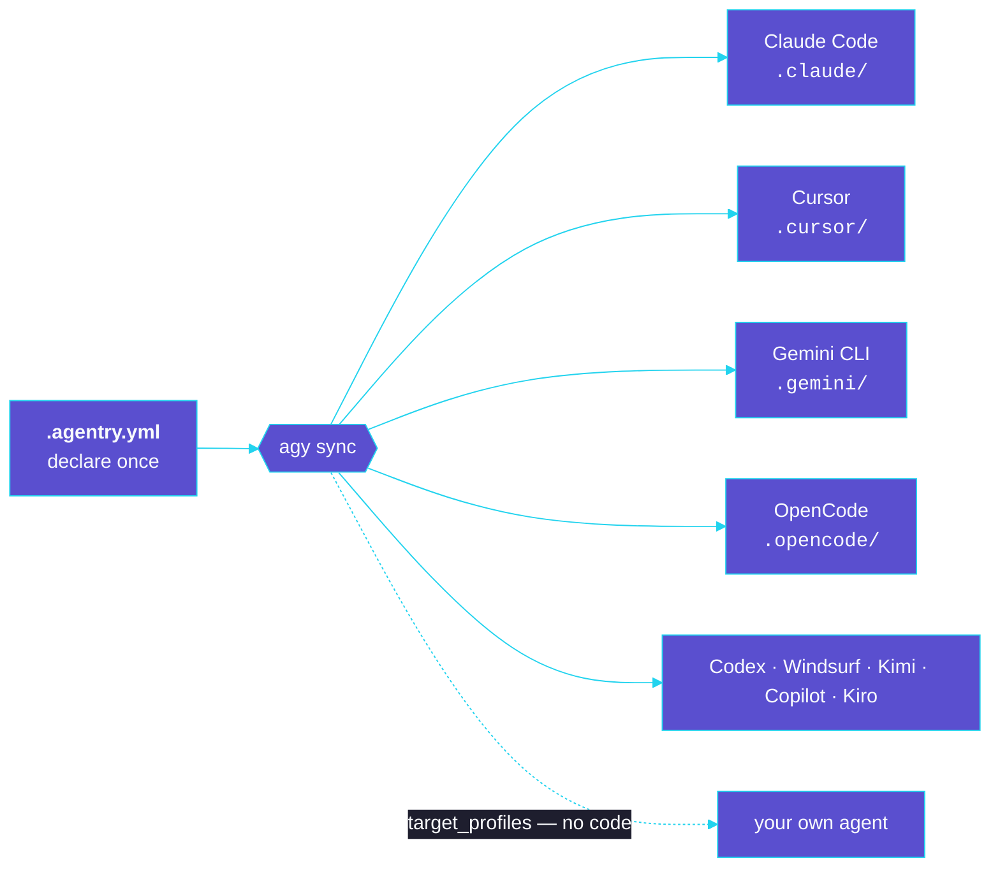
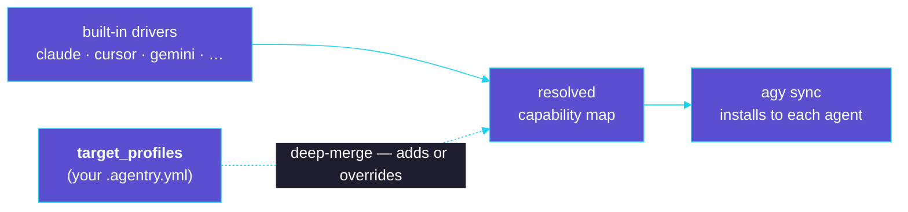

# agentry

[](https://github.com/OpenTechIL/agentry/actions/workflows/ci.yml)
[](LICENSE)
[](https://www.python.org/)
[](https://github.com/astral-sh/ruff)

**A dependency manager for AI coding agents.** `agentry` (command: `agy`) lets you
declare the skills, agents, commands, tools, hooks, and MCP servers your project
uses — then install them into Claude Code, Cursor, Gemini CLI, OpenCode, Codex,
Windsurf, Kimi, GitHub Copilot, and Kiro with one command. **Write once, deploy to any
agent** — and teach it new agents without writing code.

> agentry is a *dependency manager*, not an agent or a runtime. It installs the components
> your agents read, then gets out of the way — nothing of it runs while your agents do.

## Why agentry

The AI ecosystem is expanding without standardization. Today, developers manage AI components
by hand — copying files into `.claude/`, `.cursor/`, `.gemini/`, `.opencode/` — which means
version conflicts, security risks, and duplicated effort: the same **dependency hell** software
solved decades ago with `pip`, `yarn`, and `uv`.

Declare your components once; `agy sync` installs them into every agent you target — each in
its own native layout:



agentry treats AI components like packages:

- **`.agentry.yml`** — a single, version-controlled file declaring your sources and components.
- **`.agentry.lock`** — exact resolved commit SHAs for **deterministic, reproducible** installs.
- **`.agentry/`** — a local store (git clones / local copies), git-ignored like `node_modules`.
- One **`agy sync`** installs everything into each tool's native layout — via **symlinks**
  (skills/agents/commands/tools) or **reversible config merges** (hooks/MCP).

### What makes it different

agentry optimizes the thing you do most — *editing* agent context — and refuses to do the
things that quietly break a project. No compile step, no static artifact to regenerate, no
silent overwrites.

- **Edit once — every agent sees it instantly.** The default install is a live **symlink** into
  a single store. Change a skill in one place and Claude, Cursor, Copilot, and the rest pick it
  up immediately — there's no compile, rebuild, or re-sync step in the loop.
- **Any agent — even your own.** Targets are open strings, not a closed list. Support a
  brand-new or in-house agent in a few lines of `target_profiles` (no fork, no plugin, no
  release wait), and `agy target add` installs **shared driver overlays** so you needn't even
  write that yourself.
- **It never touches what you wrote.** A config merge writes only the keys it owns; a symlink
  refuses to clobber a real file; `agy remove` reverses cleanly. These are
  [CI-enforced guarantees](tests/test_guarantees.py), not promises.
- **Loud, never silent.** `agy doctor` surfaces undefined targets, unset `${VARs}`, and drift
  *before* they bite; `agy status`/`agy why` run the same resolver as install, so they can't
  report phantom drift install never produced.
- **Reproducible by default.** A committed, timestamp-free `.agentry.lock` pins exact SHAs;
  `agy sync --frozen` installs strictly from it and fails on any drift — clean CI.
- **A dependency manager, not a runtime.** It installs what your agents read, then gets out of
  the way — nothing of it runs while your agents do, and it embeds no model or API key.
- **Portable & interoperable.** Emit a standard `AGENTS.md` (`agy emit agents-md`), consume and
  import other agent-package formats, and — when a tool needs a different shape — translate a
  component's content with the opt-in `transform` seam.

### Isn't `AGENTS.md` enough?

For a single repo you maintain by hand, often yes. agentry is **not a competing standard** —
it's the dependency layer *above* the standard. You still keep `AGENTS.md` (agentry emits one
with `agy emit agents-md`); what agentry adds is what a flat file can't: **pinning** sources to
exact SHAs, **transitive resolution** of what a skill depends on, **multi-target fanout** to
every tool's native layout at once, and **reversible install** that never clobbers your edits.
The moment you share components across repos or teams, hand-copied `AGENTS.md` is the
copy-paste problem agentry exists to retire.

## Install

### Standalone binary (no Python required)

**macOS / Linux:**

```bash
curl -fsSL https://raw.githubusercontent.com/OpenTechIL/agentry/main/install.sh | sh
```

**Windows (PowerShell):**

```powershell
irm https://raw.githubusercontent.com/OpenTechIL/agentry/main/install.ps1 | iex
```

This downloads the right binary for your OS/arch from the [latest release](https://github.com/OpenTechIL/agentry/releases/latest), verifies its checksum against `SHA256SUMS.txt`, and installs `agy` to `~/.local/bin` (macOS/Linux) or `%LOCALAPPDATA%\Programs\agentry` (Windows). Pin a version with `AGENTRY_VERSION=0.1.3`, or change the location with `AGENTRY_INSTALL_DIR`.

**Tell your coding agent** to install it on a machine:

> Run: `curl -fsSL https://raw.githubusercontent.com/OpenTechIL/agentry/main/install.sh | sh` (or the PowerShell line above on Windows), then verify with `agy version`.

### Native installers

Prefer a double-click installer or a native package? Grab the matching asset from the
[latest release](https://github.com/OpenTechIL/agentry/releases/latest) (`<version>` is e.g. `0.1.3`):

| Platform | Asset | Install | Lands at |
|---|---|---|---|
| macOS (Apple Silicon) | `agy-<version>-macos-arm64.pkg` | double-click | `~/.local/bin/agy` (per-user, no admin) |
| macOS (Intel) | `agy-<version>-macos-x86_64.pkg` | double-click | `~/.local/bin/agy` (per-user, no admin) |
| Windows | `agy-<version>-windows-x86_64-setup.exe` | double-click | `%LOCALAPPDATA%\Programs\agentry` (adds to PATH) |
| Debian/Ubuntu | `agy_<version>_amd64.deb` | `sudo apt install ./agy_<version>_amd64.deb` | `/usr/bin/agy` |
| Fedora/RHEL | `agy-<version>-1.x86_64.rpm` | `sudo dnf install ./agy-<version>-1.x86_64.rpm` | `/usr/bin/agy` |

The macOS `.pkg` adds `~/.local/bin` to your `PATH` automatically. Every release asset is
signed with [cosign](https://github.com/OpenTechIL/agentry/blob/main/packaging/README.md#signing--cosign-keyless-sigstore)
(a `.cosign.bundle` per asset) for verifiable provenance. The binaries and installers are **not**
OS-notarized, so on first run macOS Gatekeeper / Windows SmartScreen will warn — allow it via
**System Settings → Privacy & Security** (macOS) or **More info → Run anyway** (Windows).

### With Python (uv / pipx)

Run straight from git, no install:

```bash
uvx --from git+https://github.com/OpenTechIL/agentry agy <command>
```

Or install into a project/venv:

```bash
uv pip install git+https://github.com/OpenTechIL/agentry   # then: agy <command>
```

### Homebrew · Scoop · devcontainers

Package-manager and devcontainer integrations live in [`packaging/`](packaging/):

```bash
brew install OpenTechIL/tap/agy   # macOS/Linux — via the Homebrew tap
scoop install agy                 # Windows — from a bucket that includes the manifest
```

Plus a [devcontainer Feature](packaging/devcontainer) that installs `agy` and runs
`agy sync --frozen` on create. See [packaging/README.md](packaging/README.md) for how each is
wired to releases (and the status of binary signing).

## Quickstart

Verify the install, then set up a project:

```bash
agy version                                     # confirm agy is installed
agy init --target claude --target opencode      # create .agentry.yml + .gitignore
agy source add team-skills https://github.com/org/team-skills --ref main
agy list                                        # see what's available
agy add team-skills/skill/code-reviewer         # enable + install a skill
agy add team-skills/mcp/github                  # merge an MCP server into .mcp.json
agy status                                      # check install state / drift
agy sync                                        # reconcile to match config + lock
```

New to agentry? See [How install works](#how-install-works) for what `agy sync` writes and
how to reverse it.

## Common commands

- `agy init [-t TARGET]...` — create `.agentry.yml` and add `.agentry/` to `.gitignore`.
- `agy source add NAME URL [--ref R] [--subdir DIR]` — register a source, download, sync. Any
  git host works (GitHub, GitLab, Bitbucket, Azure DevOps, Gitea, Gogs); browser "tree"/"blob"
  URLs from GitHub, GitLab, and Bitbucket are accepted and tidied automatically.
- `agy add <ref>` — enable a component (or whole catalog repo) and install it.
- `agy search [QUERY]` — search configured catalogs for repos (filter by `QUERY`); with no
  query, lists the components every catalog offers.
- `agy sync [--frozen]` — reconcile on-disk state to config + lock (idempotent). `--frozen`
  installs strictly from `.agentry.lock` and fails on any unpinned source or drift (for CI).
- `agy status` — report drift between config and what's installed.
- `agy doctor [--strict]` — preflight: undefined targets, unprovided components, unset `${VARs}`,
  unsupported type/target combos, and drift — loudly. Exits 1 on errors (or warnings with `--strict`).
- `agy why <ref>` — explain a component: its source + pinned revision and where it installs.
- `agy trust <source>` — consent for a source to run code at install (generators), pinned to its
  SHA in the lock. A trusted source runs without `--allow-run`; trust drops if the source moves.
- `agy target add NAME` / `agy target list` — install or browse shared driver overlays (how an
  agent installs) published by a catalog, making a new target resolvable without writing config.
- `agy import apm [--file apm.yml]` — translate another agent-package-manager manifest
  (`apm.yml`) into `.agentry.yml` — sources, components, targets, and inline MCP — then `agy sync`.
- `agy emit agents-md [--check] [--agent]` — compose a portable `AGENTS.md` from your
  skills/agents/commands. Deterministic by default (`--check` verifies it in CI); `--agent`
  *synthesizes* it via your own agent CLI (`transform.command` in `.agentry.yml`), gated by
  `--allow-transform`, with a diff preview + confirmation (`--yes` to auto-apply in CI).
- `agy emit triggers [--check] [-o FILE]` — register a **skill-trigger** block (each skill's
  name → its `description`, i.e. *when to auto-invoke it*) into every active target's memory
  file (`.claude/CLAUDE.md`, `AGENTS.md`, `GEMINI.md`, …). Writes only a marker-delimited block,
  so hand-authored content is untouched; idempotent and `--check`-able for CI. Use this so
  harnesses that don't auto-load skills still know when to reach for an agentry-managed skill.
- `agy update [SOURCE]` — re-resolve refs to latest and rewrite `.agentry.lock`.
- `agy version` — print the installed version.

**Full command reference → [docs/commands.md](docs/commands.md).**

## How install works

| Component type | Strategy | Destination (Claude Code example) |
|---|---|---|
| `skill` | symlink | `.claude/skills/<name>/` |
| `agent` | symlink | `.claude/agents/<name>.md` |
| `command` | symlink | `.claude/commands/<name>.md` |
| `tool` | symlink | `.claude/tools/<name>/` |
| `hook` | config merge | `.claude/settings.json` → `hooks` |
| `mcp` | config merge | `.mcp.json` → `mcpServers` |

File/dir components install via **symlink** by default (live-updating into the `.agentry/`
store); switch any to a committable real copy with `strategy: copy`. Target support varies by
tool (e.g. Cursor is rules-only); unsupported combinations are skipped with a warning.

Beyond these six component types, each target also declares a **memory file** — the
always-loaded instruction file the tool reads on every session (`.claude/CLAUDE.md`,
`AGENTS.md`, `GEMINI.md`, `.github/copilot-instructions.md`, …). `agy emit triggers` registers
a marker-delimited **skill-trigger** block there, so harnesses that don't auto-load installed
skills still learn *when* to invoke each one. Like a config merge, it writes only the block it
owns and leaves the rest of your memory file untouched.

Both sides of the mapping are data-driven: a source repo can self-describe its layout
(`agentry.yaml`), components can declare recursive version-aware `requires`, tool-specific
hook/MCP fragments route by an `-<harness>` suffix, and you can override paths or define a
**brand-new agent** entirely in `.agentry.yml` under `target_profiles` — no code, no fork.
That definition is shareable: publish it as a **driver overlay** in a catalog and anyone can
`agy target add <name>` to support the agent without writing config. Adding an agent is data,
not a code change:



See [docs/architecture.md](docs/architecture.md) for the full capability map, descriptor schema,
and safety model.

## Safe by construction

agentry never clobbers what you wrote, and every install fully reverses. These aren't
promises — they're [CI-enforced guarantees](tests/test_guarantees.py):

- **It never overwrites hand-edited config.** A config merge writes only the keys it owns and
  leaves the rest of your `.mcp.json` / `settings.json` — comments, key order, and your own
  entries — untouched. A symlink install refuses to clobber a path it doesn't own.
- **`agy remove` truly reverses.** Disabling a component deletes exactly its symlink and its
  merged keys, then prunes empty dirs — no stale files, no empty shells left behind.
- **One resolution path.** `agy status` runs the same resolver as `agy sync`, so it can never
  report drift that install didn't produce.
- **A stable, timestamp-free lockfile.** Re-running `agy sync` with unchanged inputs rewrites
  `.agentry.lock` byte-for-byte — no churn in your diffs.

Inspect any component's provenance with **`agy why <ref>`** — where it came from (source +
pinned revision) and exactly which targets it installs to. No silent autodetection.

## Supported agents

Nine agents ship as built-in drivers; a `—` means the agent has no such concept (or a format
agentry can't yet write). Add more, or override any path, from `.agentry.yml` alone.

| Component | Claude Code | Cursor | Gemini CLI | OpenCode | Codex | Windsurf | Kimi | Copilot | Kiro |
|---|:-:|:-:|:-:|:-:|:-:|:-:|:-:|:-:|:-:|
| skill | ✓ | — | ✓ | ✓ | ✓ | ✓ | ✓ | ✓ | ✓ |
| agent | ✓ | ✓ | ✓ | ✓ | — | — | — | ✓ | — |
| command | ✓ | ✓ | ✓ | ✓ | — | ✓ | — | ✓ | — |
| tool | ✓ | — | — | ✓ | — | — | — | — | — |
| hook | ✓ | — | ✓ | — | — | ✓ | — | — | — |
| mcp | ✓ | ✓ | ✓ | ✓ | ✓ | — | ✓ | ✓ | ✓ |

Plus a tool-neutral **`agents`** target that installs skills to `.agents/skills/` (the open
Agent-Skills layout) so they're portable to any AGENTS.md-aware tool. Exact destination paths
per agent live in [docs/architecture.md](docs/architecture.md#built-in-drivers).

## Installing third-party skills

Most skills on GitHub don't follow agentry's `skills/<name>/` layout. Three ways to install them:

1. **Direct-from-repo (`--path`)** — when the repo *is* a skill (its root holds `SKILL.md`) or
   keeps it at an arbitrary path:

   ```bash
   agy source add cool https://github.com/some/cool-skill
   agy add cool/skill/cool-skill --path .          # or --path packages/my-skill
   ```

2. **Self-installing tools (`generate`)** — some skills ship no skill file and generate one via
   their own CLI. Declare the commands and the files they produce; running them is opt-in
   (`--allow-run`):

   ```bash
   agy add graphify/skill/graphify \
     --generate-setup "uv tool install graphifyy" \
     --generate-command "graphify install --project" \
     --produces ".claude/skills/graphify"
   agy sync --allow-run
   ```

3. **Catalogs (name-based, the "artifactory" model)** — a catalog is a JSON file or URL mapping
   repo names to their source, so you install by name without knowing the URL or flags:

   ```bash
   agy catalog add default https://catalog.example.com/repositories.json
   agy add arckit                   # whole repo: every component it provides
   agy add arckit --type skill      # only skills (repeatable)
   agy add arckit@code-review,lint  # only the named components
   ```

   A **starter catalog** ships at [`registry/repositories.json`](registry/repositories.json) with
   six curated repos — `arckit`, `ui-ux-pro-max`, `graphify`, `superpowers`, `ponytail` (guides
   agents toward minimal, necessary code), and `caveman` (compresses agent output while preserving
   accuracy). Point a catalog at it and install by name. The catalog schema (including the `copy`
   and `namespaced` per-repo flags) is documented in [docs/architecture.md](docs/architecture.md#4-source-repo-layout--convention-or-descriptor).

4. **`.apm/`-format packages** — a repo with an `.apm/` package tree works as a source as-is:
   agentry discovers its skills/agents/prompts and installs them under agentry's naming, no
   republishing. (`agy import apm` translates the matching `apm.yml` manifest.)

   ```bash
   agy source add some-pkg https://github.com/org/some-pkg
   agy add some-pkg/skill/<name>     # or `agy list` to see what it provides
   ```

### Let your AI tool drive `agy` for you

There's a skill that closes the loop: install it and your AI tool (Claude Code, Codex, …)
learns to run these `agy` commands itself.

```bash
agy add use-agentry
```

Afterward, telling the tool *"add skill `https://github.com/OpenTechIL/markitdown-for-ai`"*
makes it run the `agy source add … && agy add … && agy sync` flow for you — so the skill lands
in `.agentry.yml`/`.agentry.lock` instead of being installed opaquely. Paste a raw
`npx skills add owner/repo` command and it offers to run the agentry equivalent or the command
as-is. (The skill lives in this repo at
[`skills/use-agentry/`](skills/use-agentry/SKILL.md) — agentry managing itself.)

## Contribute a repo to the starter catalog

Want a repo added to [`registry/repositories.json`](registry/repositories.json)? Two ways:

- **Open a PR** — clone this repo, then run `agy catalog add-repo <git-url> [--summary "…"] [--discover]`
  (or hand-edit the JSON), commit, and open a pull request. A `…/tree/<ref>/<subdir>` URL infers
  the ref and subdir; `--discover` pre-fills the components. See the
  [PR template](.github/PULL_REQUEST_TEMPLATE.md).
- **Request via an issue** — prefer not to open a PR? [File an issue](https://github.com/OpenTechIL/agentry/issues)
  with the repo URL and a one-line summary, and a maintainer will add it.

## FAQ

**Is agentry an agent, or a runtime?**
Neither — it's a *dependency manager*. It installs the skills, agents, commands, tools,
hooks, and MCP servers your agents read, then gets out of the way. Nothing of it runs
while your agents do, and it embeds no model or API key.

**Do I need Python to use it?**
No. The [standalone binary](#install) (`install.sh` / `install.ps1`) has no Python
dependency. Installing via `uvx` / `uv pip` is an alternative for Python users, not a
requirement.

**Can I `pip install agentry` from PyPI?**
No — there's no PyPI package (the name is owned by an unrelated project). Use the binary
installer or run from git with `uvx --from git+https://github.com/OpenTechIL/agentry agy …`.

**Will `agy` overwrite my hand-edited `.mcp.json` or `settings.json`?**
No. A config merge writes only the keys it owns and leaves your entries, key order, and
comments untouched; a symlink install refuses to clobber a real file; and `agy remove`
reverses cleanly. These are [CI-enforced guarantees](tests/test_guarantees.py) — see
[Safe by construction](#safe-by-construction).

**How do I support an agent that isn't built in?**
Define it under `target_profiles` in `.agentry.yml` — no fork, no plugin, no code (see
[How install works](#how-install-works)). To reuse someone else's definition, run
`agy target add <name>` to install a shared driver overlay from a catalog.

**What gets committed to git — symlinks or files?**
Symlinks by default: components live-update from the git-ignored `.agentry/` store, so an
edit in one place is seen by every agent instantly. Switch any component to a committable
real copy with `strategy: copy`.

**Does agentry ever run arbitrary code?**
Only for opt-in `generate` installers (skills that build themselves via their own CLI),
and only when you pass `--allow-run` or have granted `agy trust <source>` — which is
pinned to the source's SHA and drops if the source moves.

**How do I use it in CI?**
Commit `.agentry.lock` and run `agy sync --frozen`. It installs strictly from the lock
and fails on any unpinned source or drift, so CI is deterministic and reproducible.

**How is this different from git submodules or copy-pasting files?**
agentry adds what a flat copy or submodule can't: SHA **pinning**, **transitive**
`requires` resolution, **multi-target fanout** into every tool's native layout at once,
and **reversible** installs that never clobber your edits. See
[Isn't `AGENTS.md` enough?](#isnt-agentsmd-enough) for the longer answer.

**Does it work on Windows?**
Yes — `install.ps1` installs the Windows binary. Where the OS restricts symlinks, installs
fall back to copies automatically.

## Documentation

- [Commands](docs/commands.md) — the full `agy` command reference.
- [Architecture](docs/architecture.md) — design, config/lock/manifest model, reconcile flow, safety.
- [Knowledge base](docs/knowledge-base.md) — project-specific pitfalls, patterns, and discoveries.
- [Changelog](CHANGELOG.md) — notable changes per release.
- [Branding kit](docs/branding-kit.md) — name, identity, CLI tone of voice.
- [Contributing](CONTRIBUTING.md) — dev setup, adding targets/component types, tests.
- [Code of Conduct](CODE_OF_CONDUCT.md) — community standards.

## Contributing

Contributions are very welcome — new targets, component types, catalog entries, docs, and bug
fixes.

```bash
git clone https://github.com/OpenTechIL/agentry && cd agentry
uv venv && uv pip install -e ".[dev]"   # editable install + test/lint tooling
uv run pre-commit install               # format & lint on every commit
uv run pytest                           # run the suite
```

CI runs `ruff` and the `pytest` matrix on Python 3.10–3.13; keeping `agy sync` idempotent and the
safety invariants intact is the one hard rule. See [CONTRIBUTING.md](CONTRIBUTING.md) for the full
guide and the [Code of Conduct](CODE_OF_CONDUCT.md) before you start.

## License

[MIT](LICENSE) © 2026 OpenTech.
