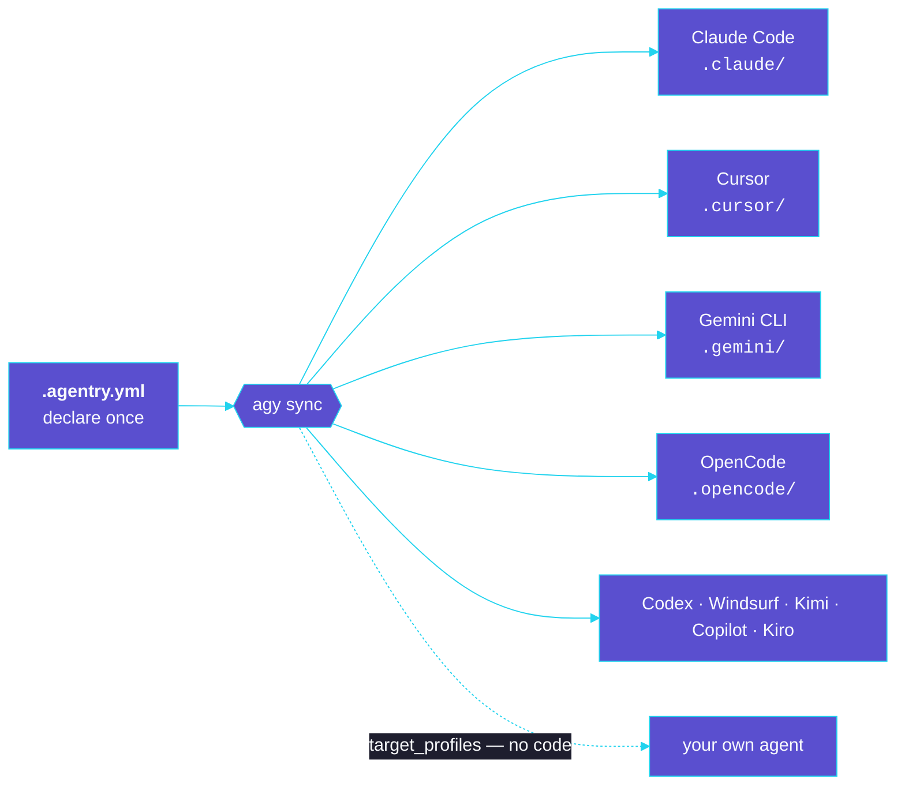
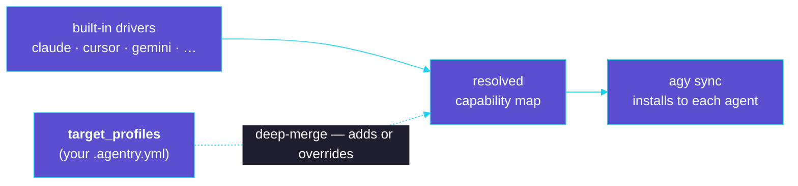

# agentry

[](https://github.com/OpenTechIL/agentry/actions/workflows/ci.yml)
[](LICENSE)
[](https://www.python.org/)
[](https://github.com/astral-sh/ruff)

**A dependency manager for AI coding agents.** `agentry` (command: `agy`) lets you
declare the skills, agents, commands, tools, hooks, and MCP servers your project
uses — then install them into Claude Code, Cursor, Gemini CLI, OpenCode, Codex,
Windsurf, Kimi, GitHub Copilot, and Kiro with one command. **Write once, deploy to any
agent** — and teach it new agents without writing code.

> agentry is a *dependency manager*, not an agent or a runtime. It installs the components
> your agents read, then gets out of the way — nothing of it runs while your agents do.

## Why agentry

The AI ecosystem is expanding without standardization. Today, developers manage AI components
by hand — copying files into `.claude/`, `.cursor/`, `.gemini/`, `.opencode/` — which means
version conflicts, security risks, and duplicated effort: the same **dependency hell** software
solved decades ago with `pip`, `yarn`, and `uv`.

Declare your components once; `agy sync` installs them into every agent you target — each in
its own native layout:



agentry treats AI components like packages:

- **`.agentry.yml`** — a single, version-controlled file declaring your sources and components.
- **`.agentry.lock`** — exact resolved commit SHAs for **deterministic, reproducible** installs.
- **`.agentry/`** — a local store (git clones / local copies), git-ignored like `node_modules`.
- One **`agy sync`** installs everything into each tool's native layout — via **symlinks**
  (skills/agents/commands/tools) or **reversible config merges** (hooks/MCP).

### What you get

- **Write once, install everywhere** — declare a skill/agent/tool/hook/MCP once; one `agy sync`
  installs it into every enabled agent, no per-tool hand-wiring or copy-paste drift.
- **Project-scoped, not global** — components live under the project (`.agentry.yml` +
  git-ignored `.agentry/`), so environments stay isolated, reproducible, and committable.
- **Split skills across projects** — granular distribution: enable a subset of a source per
  project and share sources across initiatives without version conflicts.
- **Extensible by data, not code** — override paths, declare recursive `requires`, route
  per-harness hook/MCP fragments, or define a **brand-new agent** entirely in `.agentry.yml`
  under `target_profiles` — no fork, no plugin.

## Install

### Standalone binary (no Python required)

**macOS / Linux:**

```bash
curl -fsSL https://raw.githubusercontent.com/OpenTechIL/agentry/main/install.sh | sh
```

**Windows (PowerShell):**

```powershell
irm https://raw.githubusercontent.com/OpenTechIL/agentry/main/install.ps1 | iex
```

This downloads the right binary for your OS/arch from the [latest release](https://github.com/OpenTechIL/agentry/releases/latest), verifies its checksum, and installs `agy`. Pin a version with `AGENTRY_VERSION=0.2.0` or change the location with `AGENTRY_INSTALL_DIR`. (macOS binaries are unsigned — on first run, allow it via System Settings → Privacy & Security.)

**Tell your coding agent** to install it on a machine:

> Run: `curl -fsSL https://raw.githubusercontent.com/OpenTechIL/agentry/main/install.sh | sh` (or the PowerShell line above on Windows), then verify with `agy version`.

### With Python (uv / pipx)

Run straight from git, no install:

```bash
uvx --from git+https://github.com/OpenTechIL/agentry agy <command>
```

Or install into a project/venv:

```bash
uv pip install git+https://github.com/OpenTechIL/agentry   # then: agy <command>
```

## Quickstart

```bash
agy init --target claude --target opencode      # create .agentry.yml + .gitignore
agy source add team-skills https://github.com/org/team-skills --ref main
agy list                                        # see what's available
agy add team-skills/skill/code-reviewer         # enable + install a skill
agy add team-skills/mcp/github                  # merge an MCP server into .mcp.json
agy status                                      # check install state / drift
agy sync                                        # reconcile to match config + lock
```

## Common commands

- `agy init [-t TARGET]...` — create `.agentry.yml` and add `.agentry/` to `.gitignore`.
- `agy source add NAME URL [--ref R] [--subdir DIR]` — register a source, download, sync. Any
  git host works (GitHub, GitLab, Bitbucket, Azure DevOps, Gitea, Gogs); browser "tree"/"blob"
  URLs from GitHub, GitLab, and Bitbucket are accepted and tidied automatically.
- `agy add <ref>` — enable a component (or whole catalog repo) and install it.
- `agy sync [--frozen]` — reconcile on-disk state to config + lock (idempotent). `--frozen`
  installs strictly from `.agentry.lock` and fails on any unpinned source or drift (for CI).
- `agy status` — report drift between config and what's installed.
- `agy why <ref>` — explain a component: its source + pinned revision and where it installs.
- `agy target add NAME` / `agy target list` — install or browse shared driver overlays (how an
  agent installs) published by a catalog, making a new target resolvable without writing config.
- `agy import apm [--file apm.yml]` — translate a Microsoft **apm** project (`apm.yml`) into
  `.agentry.yml` — sources, components, targets, and inline MCP servers — then `agy sync`.
- `agy emit agents-md [--check] [--agent]` — compose a portable `AGENTS.md` from your
  skills/agents/commands. Deterministic by default (`--check` verifies it in CI); `--agent`
  *synthesizes* it via your own agent CLI (`transform.command` in `.agentry.yml`), gated by
  `--allow-transform`, with a diff preview + confirmation (`--yes` to auto-apply in CI).
- `agy update [SOURCE]` — re-resolve refs to latest and rewrite `.agentry.lock`.
- `agy version` — print the installed version.

**Full command reference → [docs/commands.md](docs/commands.md).**

## How install works

| Component type | Strategy | Destination (Claude Code example) |
|---|---|---|
| `skill` | symlink | `.claude/skills/<name>/` |
| `agent` | symlink | `.claude/agents/<name>.md` |
| `command` | symlink | `.claude/commands/<name>.md` |
| `tool` | symlink | `.claude/tools/<name>/` |
| `hook` | config merge | `.claude/settings.json` → `hooks` |
| `mcp` | config merge | `.mcp.json` → `mcpServers` |

File/dir components install via **symlink** by default (live-updating into the `.agentry/`
store); switch any to a committable real copy with `strategy: copy`. Target support varies by
tool (e.g. Cursor is rules-only); unsupported combinations are skipped with a warning.

Both sides of the mapping are data-driven: a source repo can self-describe its layout
(`agentry.yaml`), components can declare recursive version-aware `requires`, tool-specific
hook/MCP fragments route by an `-<harness>` suffix, and you can override paths or define a
**brand-new agent** entirely in `.agentry.yml` under `target_profiles` — no code, no fork.
That definition is shareable: publish it as a **driver overlay** in a catalog and anyone can
`agy target add <name>` to support the agent without writing config. Adding an agent is data,
not a code change:



See [docs/architecture.md](docs/architecture.md) for the full capability map, descriptor schema,
and safety model.

## Safe by construction

agentry never clobbers what you wrote, and every install fully reverses. These aren't
promises — they're [CI-enforced guarantees](tests/test_guarantees.py):

- **It never overwrites hand-edited config.** A config merge writes only the keys it owns and
  leaves the rest of your `.mcp.json` / `settings.json` — comments, key order, and your own
  entries — untouched. A symlink install refuses to clobber a path it doesn't own.
- **`agy remove` truly reverses.** Disabling a component deletes exactly its symlink and its
  merged keys, then prunes empty dirs — no stale files, no empty shells left behind.
- **One resolution path.** `agy status` runs the same resolver as `agy sync`, so it can never
  report drift that install didn't produce.
- **A stable, timestamp-free lockfile.** Re-running `agy sync` with unchanged inputs rewrites
  `.agentry.lock` byte-for-byte — no churn in your diffs.

Inspect any component's provenance with **`agy why <ref>`** — where it came from (source +
pinned revision) and exactly which targets it installs to. No silent autodetection.

## Supported agents

Nine agents ship as built-in drivers; a `—` means the agent has no such concept (or a format
agentry can't yet write). Add more, or override any path, from `.agentry.yml` alone.

| Component | Claude Code | Cursor | Gemini CLI | OpenCode | Codex | Windsurf | Kimi | Copilot | Kiro |
|---|:-:|:-:|:-:|:-:|:-:|:-:|:-:|:-:|:-:|
| skill | ✓ | — | ✓ | ✓ | ✓ | ✓ | ✓ | ✓ | ✓ |
| agent | ✓ | ✓ | ✓ | ✓ | — | — | — | ✓ | — |
| command | ✓ | ✓ | ✓ | ✓ | — | ✓ | — | ✓ | — |
| tool | ✓ | — | — | ✓ | — | — | — | — | — |
| hook | ✓ | — | ✓ | — | — | ✓ | — | — | — |
| mcp | ✓ | ✓ | ✓ | ✓ | ✓ | — | ✓ | ✓ | ✓ |

Plus a tool-neutral **`agents`** target that installs skills to `.agents/skills/` (the open
Agent-Skills layout) so they're portable to any AGENTS.md-aware tool. Exact destination paths
per agent live in [docs/architecture.md](docs/architecture.md#built-in-drivers).

## Installing third-party skills

Most skills on GitHub don't follow agentry's `skills/<name>/` layout. Three ways to install them:

1. **Direct-from-repo (`--path`)** — when the repo *is* a skill (its root holds `SKILL.md`) or
   keeps it at an arbitrary path:

   ```bash
   agy source add cool https://github.com/some/cool-skill
   agy add cool/skill/cool-skill --path .          # or --path packages/my-skill
   ```

2. **Self-installing tools (`generate`)** — some skills ship no skill file and generate one via
   their own CLI. Declare the commands and the files they produce; running them is opt-in
   (`--allow-run`):

   ```bash
   agy add graphify/skill/graphify \
     --generate-setup "uv tool install graphifyy" \
     --generate-command "graphify install --project" \
     --produces ".claude/skills/graphify"
   agy sync --allow-run
   ```

3. **Catalogs (name-based, the "artifactory" model)** — a catalog is a JSON file or URL mapping
   repo names to their source, so you install by name without knowing the URL or flags:

   ```bash
   agy catalog add default https://catalog.example.com/repositories.json
   agy add arckit                   # whole repo: every component it provides
   agy add arckit --type skill      # only skills (repeatable)
   agy add arckit@code-review,lint  # only the named components
   ```

   A **starter catalog** ships at [`registry/repositories.json`](registry/repositories.json) with
   four curated repos — `arckit`, `ui-ux-pro-max`, `graphify`, and `superpowers`. Point a catalog
   at it and install by name. The catalog schema (including the `copy` and `namespaced` per-repo
   flags) is documented in [docs/architecture.md](docs/architecture.md#4-source-repo-layout--convention-or-descriptor).

4. **Microsoft apm packages** — a repo with an apm `.apm/` tree works as a source as-is:
   agentry discovers its skills/agents/prompts and installs them under agentry's naming, no
   republishing. `agy import apm` translates the `apm.yml` manifest; this consumes the package.

   ```bash
   agy source add some-apm-pkg https://github.com/org/apm-package
   agy add some-apm-pkg/skill/<name>     # or `agy list` to see what it provides
   ```

## Contribute a repo to the starter catalog

Want a repo added to [`registry/repositories.json`](registry/repositories.json)? Two ways:

- **Open a PR** — clone this repo, then run `agy catalog add-repo <git-url> [--summary "…"] [--discover]`
  (or hand-edit the JSON), commit, and open a pull request. A `…/tree/<ref>/<subdir>` URL infers
  the ref and subdir; `--discover` pre-fills the components. See the
  [PR template](.github/PULL_REQUEST_TEMPLATE.md).
- **Request via an issue** — prefer not to open a PR? [File an issue](https://github.com/OpenTechIL/agentry/issues)
  with the repo URL and a one-line summary, and a maintainer will add it.

## Documentation

- [Commands](docs/commands.md) — the full `agy` command reference.
- [Architecture](docs/architecture.md) — design, config/lock/manifest model, reconcile flow, safety.
- [Knowledge base](docs/knowledge-base.md) — project-specific pitfalls, patterns, and discoveries.
- [Changelog](CHANGELOG.md) — notable changes per release.
- [Branding kit](docs/branding-kit.md) — name, identity, CLI tone of voice.
- [Contributing](CONTRIBUTING.md) — dev setup, adding targets/component types, tests.
- [Code of Conduct](CODE_OF_CONDUCT.md) — community standards.

## Contributing

Contributions are very welcome — new targets, component types, catalog entries, docs, and bug
fixes.

```bash
git clone https://github.com/OpenTechIL/agentry && cd agentry
uv venv && uv pip install -e ".[dev]"   # editable install + test/lint tooling
uv run pre-commit install               # format & lint on every commit
uv run pytest                           # run the suite
```

CI runs `ruff` and the `pytest` matrix on Python 3.10–3.13; keeping `agy sync` idempotent and the
safety invariants intact is the one hard rule. See [CONTRIBUTING.md](CONTRIBUTING.md) for the full
guide and the [Code of Conduct](CODE_OF_CONDUCT.md) before you start.

## License

[MIT](LICENSE) © 2026 OpenTech.
