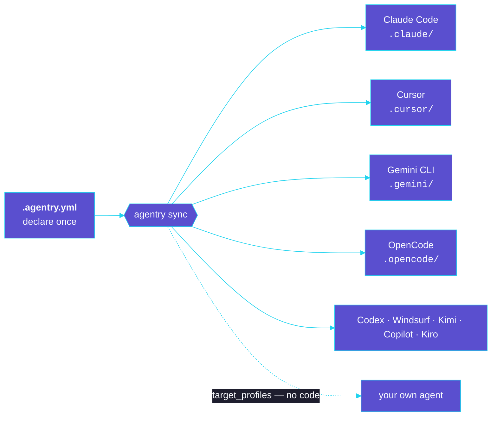
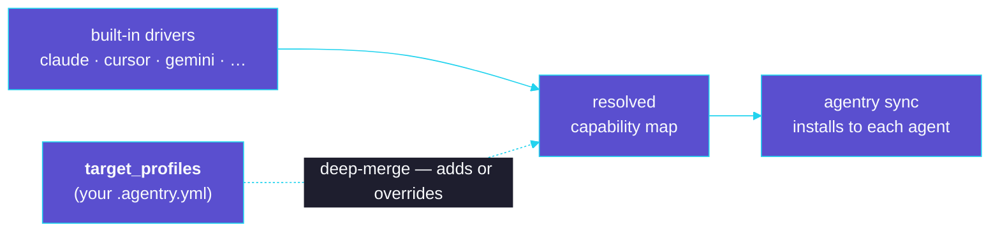

# agentry

[](https://github.com/OpenTechIL/agentry/actions/workflows/ci.yml)
[](LICENSE)
[](https://www.python.org/)
[](https://github.com/astral-sh/ruff)
[](https://github.com/OpenTechIL/agentry/releases/latest)
[](https://opentechil.github.io/agentry/)

**A dependency manager for AI coding agents.** `agentry` lets you
declare the skills, agents, commands, tools, hooks, and MCP servers your project
uses — then install them into Claude Code, Cursor, Gemini CLI, OpenCode, Codex,
Windsurf, Kimi, GitHub Copilot, and Kiro with one command. **Write once, deploy to any
agent** — and teach it new agents without writing code.

> **Command name.** The CLI is `agentry`, with two short aliases: `agyx` and `agy`.
> `agy` is *also* the command for Google's Antigravity CLI — if you have both installed,
> PATH order decides which one runs, so prefer `agentry` or `agyx`. `agentry doctor` reports
> the conflict when it sees it. See [Troubleshooting](docs/troubleshooting.md#the-agy-command-runs-the-wrong-tool).

> agentry is a *dependency manager*, not an agent or a runtime. It installs the components
> your agents read, then gets out of the way — nothing of it runs while your agents do.

## Why agentry

The AI ecosystem is expanding without standardization. Today, developers manage AI components
by hand — copying files into `.claude/`, `.cursor/`, `.gemini/`, `.opencode/` — which means
version conflicts, security risks, and duplicated effort: the same **dependency hell** software
solved decades ago with `pip`, `yarn`, and `uv`.

Declare your components once; `agentry sync` installs them into every agent you target — each in
its own native layout:


```mermaid
%%{init: {'theme':'base','themeVariables':{'primaryColor':'#5A4FCF','primaryTextColor':'#F8FAFC','lineColor':'#22D3EE','primaryBorderColor':'#22D3EE','secondaryColor':'#1E1E2E'}}}%%
flowchart LR
  Y["<b>.agentry.yml</b><br/>declare once"] --> S{{"agentry sync"}}
  S --> C["Claude Code<br/><code>.claude/</code>"]
  S --> U["Cursor<br/><code>.cursor/</code>"]
  S --> G["Gemini CLI<br/><code>.gemini/</code>"]
  S --> O["OpenCode<br/><code>.opencode/</code>"]
  S --> X["Codex · Windsurf · Kimi · Copilot · Kiro"]
  S -.->|"target_profiles — no code"| N["your own agent"]
```

agentry treats AI components like packages:

- **`.agentry.yml`** — a single, version-controlled file declaring your sources and components.
- **`.agentry.lock`** — exact resolved commit SHAs for **deterministic, reproducible** installs.
- **`.agentry/`** — a local store (git clones / local copies), git-ignored like `node_modules`.
- One **`agentry sync`** installs everything into each tool's native layout — via **symlinks**
  (skills/agents/commands/tools) or **reversible config merges** (hooks/MCP).

### What makes it different

agentry optimizes the thing you do most — *editing* agent context — and refuses to do the
things that quietly break a project. No compile step, no static artifact to regenerate, no
silent overwrites.

- **Edit once — every agent sees it instantly.** The default install is a live **symlink** into
  a single store. Change a skill in one place and Claude, Cursor, Copilot, and the rest pick it
  up immediately — there's no compile, rebuild, or re-sync step in the loop.
- **Any agent — even your own.** Targets are open strings, not a closed list. Support a
  brand-new or in-house agent in a few lines of `target_profiles` (no fork, no plugin, no
  release wait), and `agentry target add` installs **shared driver overlays** so you needn't even
  write that yourself.
- **It never touches what you wrote.** A config merge writes only the keys it owns; a symlink
  refuses to clobber a real file; `agentry remove` reverses cleanly. These are
  [CI-enforced guarantees](tests/test_guarantees.py), not promises.
- **Loud, never silent.** `agentry doctor` surfaces undefined targets, unset `${VARs}`, and drift
  *before* they bite; `agentry status`/`agentry why` run the same resolver as install, so they can't
  report phantom drift install never produced.
- **Reproducible by default.** A committed, timestamp-free `.agentry.lock` pins exact SHAs;
  `agentry sync --frozen` installs strictly from it and fails on any drift — clean CI.
- **A dependency manager, not a runtime.** It installs what your agents read, then gets out of
  the way — nothing of it runs while your agents do, and it embeds no model or API key.
- **Portable & interoperable.** Emit a standard `AGENTS.md` (`agentry emit agents-md`), consume and
  import other agent-package formats, and — when a tool needs a different shape — translate a
  component's content with the opt-in `transform` seam.

### Isn't `AGENTS.md` enough?

For a single repo you maintain by hand, often yes. agentry is **not a competing standard** —
it's the dependency layer *above* the standard. You still keep `AGENTS.md` (agentry emits one
with `agentry emit agents-md`); what agentry adds is what a flat file can't: **pinning** sources to
exact SHAs, **transitive resolution** of what a skill depends on, **multi-target fanout** to
every tool's native layout at once, and **reversible install** that never clobbers your edits.
The moment you share components across repos or teams, hand-copied `AGENTS.md` is the
copy-paste problem agentry exists to retire.

## Install

### Standalone binary (no Python required)

**macOS / Linux:**

```bash
curl -fsSL https://raw.githubusercontent.com/OpenTechIL/agentry/main/install.sh | sh
```

**Windows (PowerShell):**

```powershell
irm https://raw.githubusercontent.com/OpenTechIL/agentry/main/install.ps1 | iex
```

This downloads the right binary for your OS/arch from the [latest release](https://github.com/OpenTechIL/agentry/releases/latest), verifies its checksum against `SHA256SUMS.txt`, and installs `agentry` — plus the `agy` and `agyx` aliases — to `~/.local/bin` (macOS/Linux) or `%LOCALAPPDATA%\Programs\agentry` (Windows). Pin a version with `AGENTRY_VERSION=<version>`, or change the location with `AGENTRY_INSTALL_DIR`.

**Tell your coding agent** to install it on a machine:

> Run: `curl -fsSL https://raw.githubusercontent.com/OpenTechIL/agentry/main/install.sh | sh` (or the PowerShell line above on Windows), then verify with `agentry version`.

### Native installers

Prefer a double-click installer or a native package? Grab the matching asset from the
[latest release](https://github.com/OpenTechIL/agentry/releases/latest)
(`<version>` is the release you downloaded, without the leading `v`):

| Platform | Asset | Install | Lands at |
|---|---|---|---|
| macOS (Apple Silicon) | `agentry-<version>-macos-arm64.pkg` | double-click | `~/.local/bin/agentry` (per-user, no admin) |
| macOS (Intel) | `agentry-<version>-macos-x86_64.pkg` | double-click | `~/.local/bin/agentry` (per-user, no admin) |
| Windows | `agentry-<version>-windows-x86_64-setup.exe` | double-click | `%LOCALAPPDATA%\Programs\agentry` (adds to PATH) |
| Debian/Ubuntu | `agentry_<version>_amd64.deb` | `sudo apt install ./agentry_<version>_amd64.deb` | `/usr/bin/agentry` |
| Fedora/RHEL | `agentry-<version>-1.x86_64.rpm` | `sudo dnf install ./agentry-<version>-1.x86_64.rpm` | `/usr/bin/agentry` |

The macOS `.pkg` adds `~/.local/bin` to your `PATH` automatically. Every release asset is
signed with [cosign](https://github.com/OpenTechIL/agentry/blob/main/packaging/README.md#signing--cosign-keyless-sigstore)
(a `.cosign.bundle` per asset) for verifiable provenance. The binaries and installers are **not**
OS-notarized, so on first run macOS Gatekeeper / Windows SmartScreen will warn — allow it via
**System Settings → Privacy & Security** (macOS) or **More info → Run anyway** (Windows).

### With Python (uv / pipx)

Run straight from git, no install:

```bash
uvx --from git+https://github.com/OpenTechIL/agentry agentry <command>
```

Or install it as a tool / into a project:

```bash
uv tool install git+https://github.com/OpenTechIL/agentry   # then: agentry <command>
pipx install git+https://github.com/OpenTechIL/agentry      # same, via pipx
uv pip install git+https://github.com/OpenTechIL/agentry    # into the current venv
```

There is no PyPI package — the name is taken by an unrelated project — so all Python
install routes go through git. See the [FAQ](#faq).

### Homebrew · Scoop · devcontainers

Package-manager and devcontainer integrations live in [`packaging/`](packaging/):

```bash
brew install OpenTechIL/tap/agentry   # macOS/Linux — via the Homebrew tap
scoop install agentry                 # Windows — from a bucket that includes the manifest
```

The Homebrew tap (`OpenTechIL/homebrew-tap`) is refreshed automatically on every release, so
`brew upgrade agentry` always tracks the latest version. `brew install OpenTechIL/tap/agy`
still resolves — it is an alias for the same formula. Plus a
[devcontainer Feature](packaging/devcontainer) that installs `agentry` and runs `agentry sync --frozen`
on create. See [packaging/README.md](packaging/README.md) for how each is wired to releases
(and the status of binary signing).

## Quickstart

Verify the install, then set up a project:

```bash
agentry version                                     # confirm agentry is installed
agentry init --target claude --target opencode      # .agentry.yml + .gitignore + default catalog
agentry source add team-skills https://github.com/org/team-skills --ref main
agentry list                                        # see what's available
agentry add team-skills/skill/code-reviewer         # enable + install a skill
agentry add team-skills/mcp/github                  # merge an MCP server into .mcp.json
agentry status                                      # check install state / drift
agentry sync                                        # reconcile to match config + lock
```

New to agentry? See [How install works](#how-install-works) for what `agentry sync` writes and
how to reverse it.

## Common commands

- `agentry init [-t TARGET]... [--no-default-catalog]` — create `.agentry.yml` and add
  `.agentry/` to `.gitignore`. Registers agentry's curated catalog (`agentry`) by default so
  `agentry add <name>` works immediately; `--no-default-catalog` skips it.
- `agentry source add NAME LOCATION [--ref R] [--local] [--subdir DIR]` — register a source,
  download, sync. `--local` treats `LOCATION` as a directory on this machine instead of a
  git remote (handy for a monorepo sibling or a skill you're still writing). Any
  git host works (GitHub, GitLab, Bitbucket, Azure DevOps, Gitea, Gogs); browser "tree"/"blob"
  URLs from GitHub, GitLab, and Bitbucket are accepted and tidied automatically.
- `agentry add <ref>` — enable a component (or whole catalog repo) and install it.
- `agentry search [QUERY]` — search configured catalogs for repos (filter by `QUERY`); with no
  query, lists the components every catalog offers.
- `agentry sync [--frozen]` — reconcile on-disk state to config + lock (idempotent). `--frozen`
  installs strictly from `.agentry.lock` and fails on any unpinned source or drift (for CI).
- `agentry status` — report drift between config and what's installed.
- `agentry doctor [--strict]` — preflight: undefined targets, unprovided components, unset `${VARs}`,
  unsupported type/target combos, and drift — loudly. Exits 1 on errors (or warnings with `--strict`).
- `agentry why <ref>` — explain a component: its source + pinned revision and where it installs.
- `agentry trust <source>` — consent for a source to run code at install (generators), pinned to its
  SHA in the lock. A trusted source runs without `--allow-run`; trust drops if the source moves.
- `agentry target add NAME` / `agentry target list` — install or browse shared driver overlays (how an
  agent installs) published by a catalog, making a new target resolvable without writing config.
- `agentry import apm [--file apm.yml]` — translate another agent-package-manager manifest
  (`apm.yml`) into `.agentry.yml` — sources, components, targets, and inline MCP — then `agentry sync`.
- `agentry emit agents-md [--check] [--agent]` — compose a portable `AGENTS.md` from your
  skills/agents/commands. Deterministic by default (`--check` verifies it in CI); `--agent`
  *synthesizes* it via your own agent CLI (`transform.command` in `.agentry.yml`), gated by
  `--allow-transform`, with a diff preview + confirmation (`--yes` to auto-apply in CI).
- `agentry emit triggers [--check] [-o FILE]` — register a **skill-trigger** block (each skill's
  name → its `description`, i.e. *when to auto-invoke it*) into every active target's memory
  file (`.claude/CLAUDE.md`, `AGENTS.md`, `GEMINI.md`, …). Writes only a marker-delimited block,
  so hand-authored content is untouched; idempotent and `--check`-able for CI. Use this so
  harnesses that don't auto-load skills still know when to reach for an agentry-managed skill.
- `agentry update [SOURCE]` — re-resolve refs to latest and rewrite `.agentry.lock`.
- `agentry list` — every component discovered across all sources, grouped by source, with its state.
- `agentry remove <ref>` — uninstall a component and drop it from `.agentry.yml`. Exactly reverses
  the install: symlinks are unlinked, copies deleted, merged keys removed, empty dirs pruned.
- `agentry enable <ref>` / `agentry disable <ref>` — flip a component on or off, keeping its config
  entry. `disable` uninstalls on the next sync; `enable` reinstalls.
- `agentry install` — alias for `agentry sync`.
- `agentry deps <ref>` — show a component's transitive dependency graph.
- `agentry source remove NAME` / `agentry source list` — drop or list configured sources.
- `agentry catalog add NAME LOCATION` / `agentry catalog list` / `agentry catalog remove NAME` —
  manage the catalogs `add` and `search` resolve against.
- `agentry version` — print the installed version (also `agentry --version`).

**Full command reference → [docs/commands.md](docs/commands.md).**

## How install works

| Component type | Strategy | Destination (Claude Code example) |
|---|---|---|
| `skill` | symlink | `.claude/skills/<name>/` |
| `agent` | symlink | `.claude/agents/<name>.md` |
| `command` | symlink | `.claude/commands/<name>.md` |
| `tool` | symlink | `.claude/tools/<name>/` |
| `hook` | config merge | `.claude/settings.json` → `hooks` |
| `mcp` | config merge | `.mcp.json` → `mcpServers` |

File/dir components install via **symlink** by default (live-updating into the `.agentry/`
store). Switch a component type to a committable real copy by overriding its rule in
`target_profiles` — the strategy is a property of *where* a type installs, not of the
component itself:

```yaml
target_profiles:
  claude:
    skill:
      strategy: copy
      dest: .claude/skills/{name}
```

Target support varies by tool (e.g. Cursor has no destination for skills, tools or hooks — see the
[support matrix](#supported-agents)); unsupported combinations are skipped with a warning.

Beyond these six component types, each target also declares a **memory file** — the
always-loaded instruction file the tool reads on every session (`.claude/CLAUDE.md`,
`AGENTS.md`, `GEMINI.md`, `.github/copilot-instructions.md`, …). `agentry emit triggers` registers
a marker-delimited **skill-trigger** block there, so harnesses that don't auto-load installed
skills still learn *when* to invoke each one. Like a config merge, it writes only the block it
owns and leaves the rest of your memory file untouched.

Both sides of the mapping are data-driven: a source repo can self-describe its layout
(`agentry.yaml`), components can declare recursive version-aware `requires`, tool-specific
hook/MCP fragments route by an `-<harness>` suffix, and you can override paths or define a
**brand-new agent** entirely in `.agentry.yml` under `target_profiles` — no code, no fork.
That definition is shareable: publish it as a **driver overlay** in a catalog and anyone can
`agentry target add <name>` to support the agent without writing config. Adding an agent is data,
not a code change:


```mermaid
%%{init: {'theme':'base','themeVariables':{'primaryColor':'#5A4FCF','primaryTextColor':'#F8FAFC','lineColor':'#22D3EE','primaryBorderColor':'#22D3EE','secondaryColor':'#1E1E2E'}}}%%
flowchart LR
  B["built-in drivers<br/>claude · cursor · gemini · …"] --> M["resolved<br/>capability map"]
  P["<b>target_profiles</b><br/>(your .agentry.yml)"] -.->|"deep-merge — adds or overrides"| M
  M --> I["agentry sync<br/>installs to each agent"]
```

See [docs/architecture.md](docs/architecture.md) for the full capability map, descriptor schema,
and safety model.

## Safe by construction

agentry never clobbers what you wrote, and every install fully reverses. These aren't
promises — they're [CI-enforced guarantees](tests/test_guarantees.py):

- **It never overwrites hand-edited config.** A config merge writes only the keys it owns and
  leaves the rest of your `.mcp.json` / `settings.json` — comments, key order, and your own
  entries — untouched. A symlink install refuses to clobber a path it doesn't own.
- **`agentry remove` truly reverses.** Disabling a component deletes exactly its symlink and its
  merged keys, then prunes empty dirs — no stale files, no empty shells left behind.
- **One resolution path.** `agentry status` runs the same resolver as `agentry sync`, so it can never
  report drift that install didn't produce.
- **A stable, timestamp-free lockfile.** Re-running `agentry sync` with unchanged inputs rewrites
  `.agentry.lock` byte-for-byte — no churn in your diffs.

Inspect any component's provenance with **`agentry why <ref>`** — where it came from (source +
pinned revision) and exactly which targets it installs to. No silent autodetection.

## Supported agents

Nine agents ship as built-in drivers; a `—` means the agent has no such concept (or a format
agentry can't yet write). Add more, or override any path, from `.agentry.yml` alone.

| Component | Claude Code | Cursor | Gemini CLI | OpenCode | Codex | Windsurf | Kimi | Copilot | Kiro |
|---|:-:|:-:|:-:|:-:|:-:|:-:|:-:|:-:|:-:|
| skill | ✓ | — | ✓ | ✓ | ✓ | ✓ | ✓ | ✓ | ✓ |
| agent | ✓ | ✓ | ✓ | ✓ | — | — | — | ✓ | — |
| command | ✓ | ✓ | ✓ | ✓ | — | ✓ | — | ✓ | — |
| tool | ✓ | — | — | ✓ | — | — | — | — | — |
| hook | ✓ | — | ✓ | — | — | ✓ | — | — | — |
| mcp | ✓ | ✓ | ✓ | ✓ | ✓ | — | ✓ | ✓ | ✓ |

Plus a tool-neutral **`agents`** target that installs skills to `.agents/skills/` (the open
Agent-Skills layout) so they're portable to any AGENTS.md-aware tool. Exact destination paths
per agent live in [docs/architecture.md](docs/architecture.md#built-in-drivers).

## Installing third-party skills

Most skills on GitHub don't follow agentry's `skills/<name>/` layout. Four ways to install them:

1. **Direct-from-repo (`--path`)** — when the repo *is* a skill (its root holds `SKILL.md`) or
   keeps it at an arbitrary path:

   ```bash
   agentry source add cool https://github.com/some/cool-skill
   agentry add cool/skill/cool-skill --path .          # or --path packages/my-skill
   ```

2. **Self-installing tools (`generate`)** — some skills ship no skill file and generate one via
   their own CLI. Declare the commands and the files they produce; running them is opt-in
   (`--allow-run`):

   ```bash
   agentry add graphify/skill/graphify \
     --generate-setup "uv tool install graphifyy" \
     --generate-command "graphify install --project" \
     --produces ".claude/skills/graphify"
   agentry sync --allow-run
   ```

3. **Catalogs (name-based, the "artifactory" model)** — a catalog is a JSON file or URL mapping
   repo names to their source, so you install by name without knowing the URL or flags:

   ```bash
   agentry add arckit                   # whole repo: every component it provides
   agentry add arckit --type skill      # only skills (repeatable)
   agentry add arckit@code-review,lint  # only the named components

   # add your own catalog alongside (or instead of) the default one
   agentry catalog add team https://catalog.example.com/repositories.json
   agentry catalog remove agentry       # drop the default catalog
   ```

   `agentry init` registers the **default catalog** — this repo's
   [`registry/repositories.json`](registry/repositories.json), served from
   `raw.githubusercontent.com/OpenTechIL/agentry/refs/heads/main` — under the name `agentry`,
   so the names below resolve on a fresh install with no extra setup. It carries
   nine curated repos — `arckit`, `ui-ux-pro-max`, `graphify`, `superpowers`, `markitdown-for-ai`,
   `use-agentry`, `claude-skills` (66 language/framework/infra expert skills), `ponytail` (guides
   agents toward minimal, necessary code), and `caveman` (compresses agent output while preserving
   accuracy). The catalog schema (including the `copy`
   and `namespaced` per-repo flags) is documented in [docs/architecture.md](docs/architecture.md#4-source-repo-layout-convention-or-descriptor).

4. **`.apm/`-format packages** — a repo with an `.apm/` package tree works as a source as-is:
   agentry discovers its skills/agents/prompts and installs them under agentry's naming, no
   republishing. (`agentry import apm` translates the matching `apm.yml` manifest.)

   ```bash
   agentry source add some-pkg https://github.com/org/some-pkg
   agentry add some-pkg/skill/<name>     # or `agentry list` to see what it provides
   ```

### Let your AI tool drive `agentry` for you

There's a skill that closes the loop: install it and your AI tool (Claude Code, Codex, …)
learns to run these `agentry` commands itself.

```bash
agentry add use-agentry
```

Afterward, telling the tool *"add skill `https://github.com/OpenTechIL/markitdown-for-ai`"*
makes it run the `agentry source add … && agentry add … && agentry sync` flow for you — so the skill lands
in `.agentry.yml`/`.agentry.lock` instead of being installed opaquely. Paste a raw
`npx skills add owner/repo` command and it offers to run the agentry equivalent or the command
as-is. (The skill lives in this repo at
[`skills/use-agentry/`](skills/use-agentry/SKILL.md) — agentry managing itself.)

## Contribute a repo to the starter catalog

Want a repo added to [`registry/repositories.json`](registry/repositories.json)? Two ways:

- **Open a PR** — clone this repo, then run `agentry catalog add-repo <git-url> [--summary "…"] [--discover]`
  (or hand-edit the JSON), commit, and open a pull request. A `…/tree/<ref>/<subdir>` URL infers
  the ref and subdir; `--discover` pre-fills the components. See the
  [PR template](.github/PULL_REQUEST_TEMPLATE.md).
- **Request via an issue** — prefer not to open a PR? [File an issue](https://github.com/OpenTechIL/agentry/issues)
  with the repo URL and a one-line summary, and a maintainer will add it.

With the [`use-agentry`](skills/use-agentry/SKILL.md) skill installed, either route is one
sentence: *"add `https://github.com/owner/repo` to the agentry registry"* and your AI tool runs
the `agentry catalog add-repo` + `gh pr create` flow (or files the issue) for you.

## FAQ

**Is agentry an agent, or a runtime?**
Neither — it's a *dependency manager*. It installs the skills, agents, commands, tools,
hooks, and MCP servers your agents read, then gets out of the way. Nothing of it runs
while your agents do, and it embeds no model or API key.

**Do I need Python to use it?**
No. The [standalone binary](#install) (`install.sh` / `install.ps1`) has no Python
dependency. Installing via `uvx` / `uv pip` is an alternative for Python users, not a
requirement.

**Can I `pip install agentry` from PyPI?**
No — there's no PyPI package (the name is owned by an unrelated project). Use the binary
installer or run from git with `uvx --from git+https://github.com/OpenTechIL/agentry agentry …`.

**Will `agentry` overwrite my hand-edited `.mcp.json` or `settings.json`?**
No. A config merge writes only the keys it owns and leaves your entries, key order, and
comments untouched; a symlink install refuses to clobber a real file; and `agentry remove`
reverses cleanly. These are [CI-enforced guarantees](tests/test_guarantees.py) — see
[Safe by construction](#safe-by-construction).

**How do I support an agent that isn't built in?**
Define it under `target_profiles` in `.agentry.yml` — no fork, no plugin, no code (see
[How install works](#how-install-works)). To reuse someone else's definition, run
`agentry target add <name>` to install a shared driver overlay from a catalog.

**What gets committed to git — symlinks or files?**
Symlinks by default: components live-update from the git-ignored `.agentry/` store, so an
edit in one place is seen by every agent instantly. To commit real files instead, override
the type's rule with `strategy: copy` under `target_profiles` — see the
[configuration reference](docs/config-reference.md#target_profiles).

**Does agentry ever run arbitrary code?**
Only for opt-in `generate` installers (skills that build themselves via their own CLI),
and only when you pass `--allow-run` or have granted `agentry trust <source>` — which is
pinned to the source's SHA and drops if the source moves.

**How do I use it in CI?**
Commit `.agentry.lock` and run `agentry sync --frozen`. It installs strictly from the lock
and fails on any unpinned source or drift, so CI is deterministic and reproducible.

**How is this different from git submodules or copy-pasting files?**
agentry adds what a flat copy or submodule can't: SHA **pinning**, **transitive**
`requires` resolution, **multi-target fanout** into every tool's native layout at once,
and **reversible** installs that never clobber your edits. See
[Isn't `AGENTS.md` enough?](#isnt-agentsmd-enough) for the longer answer.

**Does it work on Windows?**
Yes — `install.ps1` installs the Windows binary. One caveat: the default install strategy is
a **symlink**, and Windows only allows unprivileged symlink creation with
[Developer Mode](https://learn.microsoft.com/en-us/windows/apps/get-started/enable-your-device-for-development)
enabled. Without it, `sync` fails on link creation; enable Developer Mode, run as
administrator, or switch the affected types to `strategy: copy` in `target_profiles`. See
[Troubleshooting](docs/troubleshooting.md#sync-fails-creating-symlinks-on-windows).

## Documentation

Rendered site: **<https://opentechil.github.io/agentry/>**

- [Commands](docs/commands.md) — the full `agentry` command reference.
- [Configuration reference](docs/config-reference.md) — every `.agentry.yml` key, with an
  annotated example.
- [Authoring](docs/authoring.md) — write a component repo, a descriptor, or a catalog entry.
- [Troubleshooting](docs/troubleshooting.md) — the failures people actually hit, and the fix.
- [Architecture](docs/architecture.md) — design, config/lock/manifest model, reconcile flow, safety.
- [Knowledge base](docs/knowledge-base.md) — engineering journal: pitfalls, decisions, and
  discoveries recorded as they happened (written for maintainers, not as a user guide).
- [Changelog](CHANGELOG.md) — notable changes per release.
- [Branding kit](docs/branding-kit.md) — name, identity, CLI tone of voice.
- [Contributing](CONTRIBUTING.md) — dev setup, adding targets/component types, tests.
- [Code of Conduct](CODE_OF_CONDUCT.md) — community standards.

## Contributing

Contributions are very welcome — new targets, component types, catalog entries, docs, and bug
fixes.

```bash
git clone https://github.com/OpenTechIL/agentry && cd agentry
uv venv && uv pip install -e ".[dev]"   # editable install + test/lint tooling
uv run pre-commit install               # format & lint on every commit
uv run pytest                           # run the suite
uv run mypy                             # type-check src/
```

CI runs `ruff` and the `pytest` matrix on Python 3.10–3.13; keeping `agentry sync` idempotent and the
safety invariants intact is the one hard rule. See [CONTRIBUTING.md](CONTRIBUTING.md) for the full
guide and the [Code of Conduct](CODE_OF_CONDUCT.md) before you start.

## License

[MIT](LICENSE) © 2026 OpenTech.
