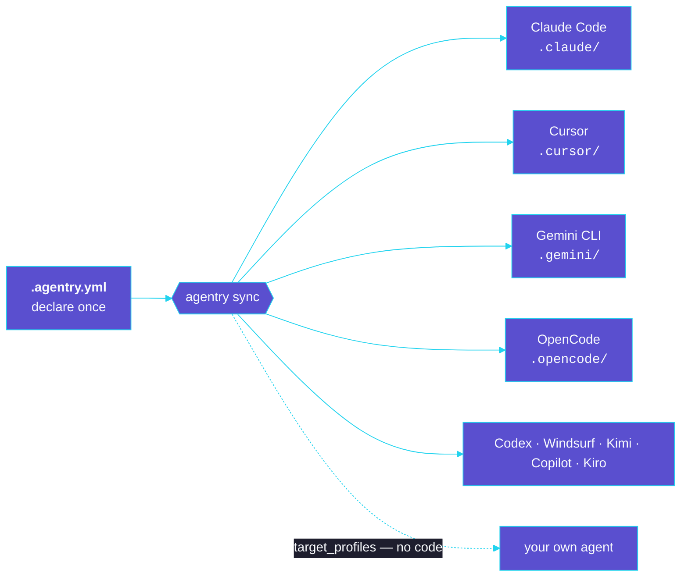
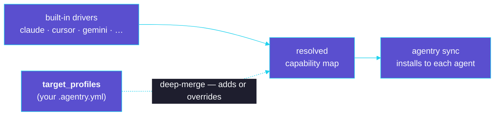

# agentry

[](https://github.com/OpenTechIL/agentry/actions/workflows/ci.yml)
[](LICENSE)
[](https://www.python.org/)
[](https://github.com/astral-sh/ruff)
[](https://github.com/OpenTechIL/agentry/releases/latest)
[](https://opentechil.github.io/agentry/)

**A package manager for the files your AI coding agents read.**

If you use Claude Code, Cursor, Copilot, Gemini CLI or any of their cousins, you have
folders like `.claude/`, `.cursor/` and `.gemini/` filling up with skills, subagent
definitions, slash commands, hooks and MCP server configs. Right now you probably manage
them by copying files around. agentry does for those files what `npm` did for JavaScript
libraries: **you declare what you want in one file, and one command installs it into every
tool you use.**

```bash
agentry init --target claude      # set up this project
agentry add caveman               # install a skill pack by name
```

That's it — the skills are now live in `.claude/`, pinned to an exact commit, and
`agentry remove` takes them back out cleanly.

> **New here?** Jump to the [5-minute quickstart](#quickstart). If you'd rather learn the
> vocabulary first, read [Concepts in 60 seconds](#concepts-in-60-seconds).

---

## Table of contents

- [Why you might want this](#why-you-might-want-this)
- [Concepts in 60 seconds](#concepts-in-60-seconds)
- [Install](#install)
- [Quickstart](#quickstart) — a real, runnable walkthrough
- [Commands you'll actually use](#commands-youll-actually-use)
- [How install works](#how-install-works)
- [Safe by construction](#safe-by-construction)
- [Supported agents](#supported-agents)
- [Installing third-party skills](#installing-third-party-skills)
- [FAQ](#faq)
- [Documentation](#documentation)

## Why you might want this

Here's the problem in one picture. You find a useful skill on GitHub and you want it in
Claude Code *and* Cursor *and* Copilot.

**Without agentry:**

```bash
git clone https://github.com/some/skill /tmp/skill
cp -r /tmp/skill/skills/reviewer .claude/skills/reviewer
cp -r /tmp/skill/skills/reviewer .cursor/rules/     # different layout, reformat by hand
# ...then paste its MCP server config into .mcp.json by hand.
# Which commit was that? Nobody knows. Upstream fixed a bug? Do it all again.
# A teammate clones your repo? They get your copies, frozen in time.
```

**With agentry:**

```bash
agentry add some-skill      # resolves it, pins the commit, installs to every target
agentry update              # pull upstream fixes
agentry remove some-skill   # clean uninstall, nothing left behind
```

The AI tooling ecosystem is growing fast and without a shared standard for *where* files
go. Every tool invented its own directory layout, so the same skill has to be installed
three different ways. That's the same **dependency hell** that `pip`, `npm` and `uv` solved
for source code — agentry solves it for agent context.

You declare your components once; `agentry sync` installs them into every agent you target,
each in that tool's own native layout:


```mermaid
%%{init: {'theme':'base','themeVariables':{'primaryColor':'#5A4FCF','primaryTextColor':'#F8FAFC','lineColor':'#22D3EE','primaryBorderColor':'#22D3EE','secondaryColor':'#1E1E2E'}}}%%
flowchart LR
  Y["<b>.agentry.yml</b><br/>declare once"] --> S{{"agentry sync"}}
  S --> C["Claude Code<br/><code>.claude/</code>"]
  S --> U["Cursor<br/><code>.cursor/</code>"]
  S --> G["Gemini CLI<br/><code>.gemini/</code>"]
  S --> O["OpenCode<br/><code>.opencode/</code>"]
  S --> X["Codex · Windsurf · Kimi · Copilot · Kiro"]
  S -.->|"target_profiles — no code"| N["your own agent"]
```

> **agentry is not an agent and not a runtime.** It installs the files your agents read,
> then gets out of the way. Nothing of it runs while your agents do, and it contains no
> model and no API key.

### What makes it different

agentry optimizes the thing you do most — *editing* agent context — and refuses to do the
things that quietly break a project. No compile step, no generated artifact to regenerate,
no silent overwrites.

- **Edit once, every agent sees it instantly.** The default install is a live **symlink**
  into one shared store, so changing a skill in one place updates Claude, Cursor, Copilot
  and the rest immediately. There's no rebuild or re-sync step in your editing loop.
- **Works with any agent — even one you invented.** The list of supported tools isn't
  closed. You can add a brand-new or in-house agent in a few lines of config (no fork, no
  plugin, no waiting for a release), and `agentry target add` can fetch someone else's
  definition so you don't have to write even that.
- **It never touches what you wrote.** Merging into a config file writes only the keys it
  owns; a symlink refuses to overwrite a real file; `agentry remove` reverses cleanly.
  These are [CI-enforced guarantees](tests/test_guarantees.py), not promises.
- **Loud, never silent.** `agentry doctor` surfaces problems — undefined targets, unset
  environment variables, on-disk drift — *before* they bite you mid-session.
- **Reproducible.** A committed lockfile pins exact commits, and `agentry sync --frozen`
  installs strictly from it, so CI and your teammates get identical setups.
- **Portable.** Emit a standard `AGENTS.md`, import other agent-package formats, and
  translate a component's content when a tool needs a different shape.

### Isn't `AGENTS.md` enough?

For a single repo you maintain by hand, often yes — and agentry is **not a competing
standard**. It's the dependency layer *above* the standard: you still keep `AGENTS.md`
(agentry can generate one with `agentry emit agents-md`). What agentry adds is what a flat
file can't do: **pinning** sources to exact commits, **transitive resolution** of what a
skill itself depends on, **fanout** into every tool's native layout at once, and
**reversible installs** that never clobber your edits. The moment you share components
across repos or teammates, a hand-copied `AGENTS.md` becomes the copy-paste problem agentry
exists to retire.

## Concepts in 60 seconds

Five nouns. Once these click, the whole CLI reads naturally.

| Term | In plain words | Example |
|---|---|---|
| **Component** | One thing you install. Six kinds: `skill`, `agent`, `command`, `tool`, `hook`, `mcp`. | a code-review skill |
| **Source** | Where components come from — a git repo, or a folder on your machine. | `github.com/obra/superpowers` |
| **Target** | An AI tool you want to install *into*. | `claude`, `cursor`, `gemini` |
| **Catalog** | A published index mapping a short name to a source, so you can install by name instead of by URL. | `agentry add caveman` |
| **Driver** | The rules for where each component type goes *for one target*. Nine ship built in; you can define your own in config. | skills → `.claude/skills/<name>/` |

And three files, which behave just like their equivalents in other package managers:

| File | Commit it? | Analogous to | What it is |
|---|---|---|---|
| `.agentry.yml` | **yes** | `package.json` | What you *want*. Hand-editable; your comments survive agentry's own edits. |
| `.agentry.lock` | **yes** | `package-lock.json` | Exact resolved commits, so installs are reproducible. |
| `.agentry/` | no (git-ignored) | `node_modules/` | The local store of downloaded sources. |

A component's full name is `<source>/<type>/<name>` — for example
`superpowers/skill/writing-plans`. That's what commands like `add`, `remove` and `why`
take. You rarely have to type one out: `agentry list` prints the real names, and installing
by catalog name (`agentry add superpowers`) grabs everything a repo offers at once.

## Install

Pick whichever line matches your setup. All of them give you the same `agentry` command.

### The quickest way (no Python needed)

**macOS / Linux:**

```bash
curl -fsSL https://raw.githubusercontent.com/OpenTechIL/agentry/main/install.sh | sh
```

**Windows (PowerShell):**

```powershell
irm https://raw.githubusercontent.com/OpenTechIL/agentry/main/install.ps1 | iex
```

This downloads the right binary for your OS and CPU from the
[latest release](https://github.com/OpenTechIL/agentry/releases/latest), verifies its
checksum against `SHA256SUMS.txt`, and installs it to `~/.local/bin` (macOS/Linux) or
`%LOCALAPPDATA%\Programs\agentry` (Windows).

Check it worked:

```bash
agentry --version
```

If that says "command not found", the install directory isn't on your `PATH` — the
installer prints the exact line to add.

<details>
<summary><b>Optional environment variables</b></summary>

- `AGENTRY_VERSION=<version>` — install a specific release instead of the latest.
- `AGENTRY_INSTALL_DIR=<dir>` — install somewhere other than the default.

</details>

### Package managers

```bash
brew install OpenTechIL/tap/agentry   # macOS / Linux
scoop install agentry                 # Windows
```

The Homebrew tap is refreshed automatically on every release, so `brew upgrade agentry`
always tracks the latest version.

### Double-click installers and native packages

Grab the matching asset from the
[latest release](https://github.com/OpenTechIL/agentry/releases/latest) (`<version>` is
the release you downloaded, without the leading `v`):

| Platform | Asset | How to install | Lands at |
|---|---|---|---|
| macOS (Apple Silicon) | `agentry-<version>-macos-arm64.pkg` | double-click | `~/.local/bin/agentry` (per-user, no admin) |
| macOS (Intel) | `agentry-<version>-macos-x86_64.pkg` | double-click | `~/.local/bin/agentry` (per-user, no admin) |
| Windows | `agentry-<version>-windows-x86_64-setup.exe` | double-click | `%LOCALAPPDATA%\Programs\agentry` (adds to PATH) |
| Debian/Ubuntu | `agentry_<version>_amd64.deb` | `sudo apt install ./agentry_<version>_amd64.deb` | `/usr/bin/agentry` |
| Fedora/RHEL | `agentry-<version>-1.x86_64.rpm` | `sudo dnf install ./agentry-<version>-1.x86_64.rpm` | `/usr/bin/agentry` |

The macOS `.pkg` adds `~/.local/bin` to your `PATH` for you.

**Expect a security warning on first run.** Every release asset is
[signed with cosign](https://github.com/OpenTechIL/agentry/blob/main/packaging/README.md#signing--cosign-keyless-sigstore)
for verifiable provenance, but the binaries aren't OS-notarized — so macOS Gatekeeper and
Windows SmartScreen will flag them. Allow it via **System Settings → Privacy & Security**
(macOS) or **More info → Run anyway** (Windows).

### If you're a Python user

```bash
uv tool install git+https://github.com/OpenTechIL/agentry   # recommended
pipx install git+https://github.com/OpenTechIL/agentry      # same, via pipx
```

Or run it once without installing anything:

```bash
uvx --from git+https://github.com/OpenTechIL/agentry agentry --help
```

There's no PyPI package — the name `agentry` on PyPI belongs to an unrelated project — so
every Python route installs from git.

### In a devcontainer or Codespace

A [devcontainer Feature](packaging/devcontainer) installs agentry and runs
`agentry sync --frozen` when the container is created, so a fresh Codespace comes up with
every agent component already in place. See [packaging/README.md](packaging/README.md) for
how each channel is wired to releases.

### A note on the command name

The command is **`agentry`**. Two short aliases are installed alongside it: `agyx` and
`agy`.

`agy` is *also* the command for Google's Antigravity CLI. If you have both tools installed,
whichever comes first on your `PATH` wins — silently. So **prefer `agentry` or `agyx`**.
`agentry doctor` will tell you if it detects the clash, and
[Troubleshooting](docs/troubleshooting.md#the-agy-command-runs-the-wrong-tool) explains how
to check.

## Quickstart

A real walkthrough, about five minutes. Every command below was actually run, and the
output is what it printed (the wider tables are trimmed to fit this page). Follow along in
a scratch directory and you'll see the same thing.

### 1. Set up a project

Run this in a git repo. agentry reads its config from the directory you're in, so use your
project root:

```console
$ agentry init --target claude
Initialized agentry for targets: claude
  catalog 'agentry' → https://raw.githubusercontent.com/OpenTechIL/agentry/refs/heads/main/registry/repositories.json
  added .agentry/ to .gitignore
```

Three things just happened:

1. **`.agentry.yml` was created** — your declaration file, currently listing `claude` as
   the only target. Add more with repeated `-t` flags:
   `agentry init -t claude -t cursor -t copilot`.
2. **A catalog was registered**, so you can install things by short name right away with no
   URLs to look up. (Skip it with `--no-default-catalog`.)
3. **`.agentry/` was added to `.gitignore`** — that's the download cache, like
   `node_modules/`. It should never be committed.

### 2. See what's available

```console
$ agentry search
                                  Catalog repositories
┏━━━━━━━━━━━━━━━━━━━┳━━━━━━━━━┳━━━━━━━━━━━━┳━━━━━━━━━━━━━━━━━━━━━━━━━━━━━━━━━━━━━━━━━━━┓
┃ repo              ┃ catalog ┃ components ┃ summary                                   ┃
┡━━━━━━━━━━━━━━━━━━━╇━━━━━━━━━╇━━━━━━━━━━━━╇━━━━━━━━━━━━━━━━━━━━━━━━━━━━━━━━━━━━━━━━━━━┩
│ arckit            │ agentry │ whole repo │ ArcKit — enterprise architecture          │
│                   │         │            │ governance toolkit …                      │
│ caveman           │ agentry │ whole repo │ Caveman — compresses agent output by ~65% │
│ claude-skills     │ agentry │ whole repo │ Fullstack dev skill pack — 66 language,   │
│                   │         │            │ framework and infra expert skills …       │
│ markitdown-for-ai │ agentry │ 1 curated  │ MarkItDown4AI — converts documents to     │
│                   │         │            │ Markdown for AI agents.                   │
│ superpowers       │ agentry │ whole repo │ Superpowers — a library of process skills │
└───────────────────┴─────────┴────────────┴───────────────────────────────────────────┘
```

`agentry search <query>` filters the list. **"whole repo"** means agentry installs
everything the repo provides; **"1 curated"** means the catalog author picked out specific
components.

### 3. Install something

```console
$ agentry add markitdown-for-ai
Added markitdown-for-ai (1 component(s) from catalog)
  resolved markitdown-for-ai → 60d03a0cdb6e
  + link .claude/skills/document-to-markdown
```

Read that bottom-up: agentry resolved the repo to commit `60d03a0cdb6e` (recorded in
`.agentry.lock`), then created one **link** at `.claude/skills/document-to-markdown`.
Claude Code picks the skill up on its next session.

`add` does the download *and* the install, so there's no separate step to remember. It also
writes the component into `.agentry.yml`, which is what makes your setup reproducible.

### 4. Look at what it did

```console
$ ls -l .claude/skills/
document-to-markdown -> ../../.agentry/markitdown-for-ai/skills/document-to-markdown
```

It's a **symlink** into the store, not a copy. That's the default because editing the skill
in one place then instantly updates every tool that uses it — no re-sync. (If you'd rather
commit real files, see [the FAQ](#faq).)

Two commands answer "what's installed, and where did it come from?":

```console
$ agentry status
┏━━━━━━━━━━━━━━━━━━━━━━━━━━━━━━┳━━━━━━━━┳━━━━━━━━━━━━━━━━━━━━━━━━━━━━━━┳━━━━━━━┓
┃ ref                          ┃ target ┃ where                        ┃ state ┃
┡━━━━━━━━━━━━━━━━━━━━━━━━━━━━━━╇━━━━━━━━╇━━━━━━━━━━━━━━━━━━━━━━━━━━━━━━╇━━━━━━━┩
│ markitdown-for-ai/skill/doc… │ claude │ .claude/skills/document-to-… │ ok    │
└──────────────────────────────┴────────┴──────────────────────────────┴───────┘

$ agentry why markitdown-for-ai/skill/document-to-markdown
markitdown-for-ai/skill/document-to-markdown
├── source: markitdown-for-ai git https://github.com/OpenTechIL/markitdown-for-ai
│   @ 60d03a0cdb6e (ref main)
└── installs to
    └── claude  .claude/skills/document-to-markdown  ok
```

`state: ok` means what's on disk matches what your config asks for. Delete that symlink by
hand and it would read `missing` — then `agentry sync` puts it back.

### 5. Check everything's healthy

```console
$ agentry doctor
  ✓ all  all targets resolve, every component installs, no drift
doctor: all checks passed.
```

`doctor` is the command to run when something feels off. It catches targets you named but
never defined, components a source doesn't actually provide, environment variables your
config references but that aren't set, and on-disk drift. Worth running in CI with
`--strict`.

### 6. Undo it

```console
$ agentry remove markitdown-for-ai/skill/document-to-markdown
Removed markitdown-for-ai/skill/document-to-markdown
  resolved markitdown-for-ai → 60d03a0cdb6e
  - link .claude/skills/document-to-markdown
```

The symlink is gone, the now-empty `.claude/skills/` directory was cleaned up, and the
entry was dropped from `.agentry.yml`. Nothing is left behind — that's a
[tested guarantee](#safe-by-construction), not a hope.

Note `remove` takes the **full component ref**, not the catalog name. To detach a whole
repo at once, use `agentry source remove markitdown-for-ai`.

### 7. Commit it

```bash
git add .agentry.yml .agentry.lock
git commit -m "add document-to-markdown skill"
```

Now a teammate — or CI — reproduces your exact setup with one command:

```bash
agentry sync --frozen
```

`--frozen` installs strictly from the lockfile and fails rather than resolving anything
new, which is exactly what you want in CI.

### Where to go next

- **Source isn't in a catalog?** `agentry source add <name> <git-url>`, then `agentry list`
  to see the component names it offers.
- **Want your AI tool to run these commands for you?** See
  [Let your AI tool drive agentry](#let-your-ai-tool-drive-agentry-for-you).
- **Something not working?** [Troubleshooting](docs/troubleshooting.md) covers the common
  failures. If you hit an error running `agentry` from a subdirectory, that's the first
  entry.

## Commands you'll actually use

Grouped by what you're trying to do. Full reference with every flag:
**[docs/commands.md](docs/commands.md)**.

### Day-to-day

| Command | What it does |
|---|---|
| `agentry init [-t TARGET]...` | Set up a project: create `.agentry.yml`, register the default catalog, git-ignore `.agentry/`. |
| `agentry search [QUERY]` | Browse catalogs for installable repos. No query lists everything. |
| `agentry add <ref>` | Install a component, or a whole catalog repo. Downloads and installs in one step. |
| `agentry remove <ref>` | Uninstall and drop from config. Fully reverses the install. |
| `agentry list` | Every component your configured sources provide, with its state. |
| `agentry sync` | Make the filesystem match your config + lock. Safe to re-run; does nothing if already correct. |
| `agentry update [SOURCE]` | Pull upstream changes: re-resolve to the latest commit and rewrite the lock. |

### Inspecting and debugging

| Command | What it does |
|---|---|
| `agentry status` | What's installed, where, and whether it drifted from your config. |
| `agentry why <ref>` | Where a component came from (source + pinned commit) and every place it installs. |
| `agentry doctor [--strict]` | Preflight check for undefined targets, missing components, unset `${VARs}` and drift. Exits non-zero on problems. |
| `agentry deps <ref>` | The component's transitive dependency graph. |
| `agentry --version` | The installed version. |

### Managing sources and catalogs

| Command | What it does |
|---|---|
| `agentry source add NAME LOCATION [--ref R] [--local] [--subdir DIR]` | Register a repo — or, with `--local`, a folder on this machine — and install from it. Browser "tree" URLs from GitHub, GitLab and Bitbucket are accepted and tidied up automatically. |
| `agentry source remove NAME` / `source list` | Detach or list sources. |
| `agentry catalog add NAME LOCATION` / `catalog list` / `catalog remove NAME` | Manage the catalogs that `add` and `search` resolve names against. |
| `agentry target add NAME` / `target list` | Install or browse a shared **driver** definition published by a catalog, so a new tool works without you writing config. |

### Occasional

| Command | What it does |
|---|---|
| `agentry enable <ref>` / `disable <ref>` | Turn a component off without forgetting it. `disable` uninstalls on the next sync; `enable` puts it back. |
| `agentry trust <source>` | Allow a source to run its own installer at install time. Pinned to that source's commit, and revoked automatically if the source moves. |
| `agentry sync --frozen` | Install strictly from `.agentry.lock`, failing on anything unpinned. Use this in CI. |
| `agentry emit agents-md [--check]` | Generate a portable `AGENTS.md` from your skills, agents and commands. `--check` verifies it's up to date in CI. |
| `agentry emit triggers [--check]` | Write a "when to use each skill" block into every target's memory file (`CLAUDE.md`, `AGENTS.md`, …), so tools that don't auto-load skills still know to reach for them. |
| `agentry import apm [--file apm.yml]` | Convert another agent package manager's manifest into `.agentry.yml`. |
| `agentry install` | Alias for `agentry sync`. |

## How install works

Each component type has a natural home in each tool. For Claude Code:

| Component type | How it installs | Where it lands |
|---|---|---|
| `skill` | symlink | `.claude/skills/<name>/` |
| `agent` | symlink | `.claude/agents/<name>.md` |
| `command` | symlink | `.claude/commands/<name>.md` |
| `tool` | symlink | `.claude/tools/<name>/` |
| `hook` | config merge | `.claude/settings.json` → `hooks` |
| `mcp` | config merge | `.mcp.json` → `mcpServers` |

There are two install styles, because the two kinds of thing need different handling:

- **Symlink**, for files and directories. A pointer into the shared `.agentry/` store, so
  an edit is instantly visible to every tool. agentry refuses to replace a real file, or a
  symlink it doesn't own.
- **Config merge**, for hooks and MCP servers, which have to live *inside* a shared JSON or
  TOML file. agentry writes only the specific keys it owns and leaves everything else —
  your entries, your key order, your comments — exactly as it found them.

Prefer committable real files over symlinks? Override the rule for that component type.
Note that the install style is a property of *where a type goes for a target*, not of an
individual component:

```yaml
target_profiles:
  claude:
    skill:
      strategy: copy
      dest: .claude/skills/{name}
```

Not every tool supports every type — Cursor, for instance, has nowhere to put skills, tools
or hooks (see the [support matrix](#supported-agents)). Unsupported combinations are
skipped with a warning rather than failing your sync.

### Memory files

Beyond the six component types, each target has a **memory file**: the always-loaded
instruction file the tool reads every session (`.claude/CLAUDE.md`, `AGENTS.md`,
`GEMINI.md`, `.github/copilot-instructions.md`, …).

`agentry emit triggers` writes a small, marker-delimited block there listing each skill and
*when to use it*. That matters because some harnesses don't automatically notice installed
skills — this is how they learn a skill exists. Like a config merge, it only ever touches
its own block.

### Adding a tool agentry has never heard of

Both sides of the mapping are data, not code. A source repo can describe its own layout
(`agentry.yaml`), components can declare dependencies that agentry resolves recursively,
and you can define a **brand-new agent** entirely in `.agentry.yml` under
`target_profiles` — no fork, no plugin, no pull request.

That definition is shareable: publish it in a catalog and anyone can run
`agentry target add <name>` to support the tool without writing any config themselves.


```mermaid
%%{init: {'theme':'base','themeVariables':{'primaryColor':'#5A4FCF','primaryTextColor':'#F8FAFC','lineColor':'#22D3EE','primaryBorderColor':'#22D3EE','secondaryColor':'#1E1E2E'}}}%%
flowchart LR
  B["built-in drivers<br/>claude · cursor · gemini · …"] --> M["resolved<br/>capability map"]
  P["<b>target_profiles</b><br/>(your .agentry.yml)"] -.->|"deep-merge — adds or overrides"| M
  M --> I["agentry sync<br/>installs to each agent"]
```

Full details: the [configuration reference](docs/config-reference.md) for every key, and
[architecture](docs/architecture.md) for the design.

## Safe by construction

agentry never clobbers what you wrote, and every install fully reverses. These aren't
promises — they're [CI-enforced guarantees](tests/test_guarantees.py):

- **It never overwrites hand-edited config.** A config merge writes only the keys it owns
  and leaves the rest of your `.mcp.json` / `settings.json` — comments, key order, and your
  own entries — untouched. A symlink install refuses to clobber a path it doesn't own.
- **`agentry remove` truly reverses.** It deletes exactly its own symlinks and merged keys,
  then prunes the directories that are now empty. No stale files, no empty shells.
- **One resolution path.** `agentry status` runs the same resolver as `agentry sync`, so it
  can't report drift that install didn't actually produce.
- **A stable lockfile.** Re-running `agentry sync` with unchanged inputs rewrites
  `.agentry.lock` byte-for-byte — no mystery churn in your diffs.
- **Untrusted input stays in its lane.** Destinations published by a catalog are validated
  and confined to your project, so a catalog can't write outside it. Running third-party
  code always requires your explicit consent.

Inspect any component's provenance with **`agentry why <ref>`** — where it came from and
exactly which targets it installs to. No silent autodetection.

## Supported agents

Nine agents ship as built-in drivers. A `—` means the agent has no such concept (or uses a
format agentry can't write yet). You can add more, or override any path, from
`.agentry.yml` alone.

| Component | Claude Code | Cursor | Gemini CLI | OpenCode | Codex | Windsurf | Kimi | Copilot | Kiro |
|---|:-:|:-:|:-:|:-:|:-:|:-:|:-:|:-:|:-:|
| skill | ✓ | — | ✓ | ✓ | ✓ | ✓ | ✓ | ✓ | ✓ |
| agent | ✓ | ✓ | ✓ | ✓ | — | — | — | ✓ | — |
| command | ✓ | ✓ | ✓ | ✓ | — | ✓ | — | ✓ | — |
| tool | ✓ | — | — | ✓ | — | — | — | — | — |
| hook | ✓ | — | ✓ | — | — | ✓ | — | — | — |
| mcp | ✓ | ✓ | ✓ | ✓ | ✓ | — | ✓ | ✓ | ✓ |

Plus a tool-neutral **`agents`** target that installs skills to `.agents/skills/` (the open
Agent-Skills layout), so they're portable to any `AGENTS.md`-aware tool. Exact destination
paths per agent are in [docs/architecture.md](docs/architecture.md#built-in-drivers).

## Installing third-party skills

Most skills on GitHub don't follow agentry's `skills/<name>/` layout. Four ways to install
them anyway, easiest first.

### 1. By name, from a catalog

The path of least resistance, and what `agentry init` sets you up for:

```bash
agentry add arckit                   # everything the repo provides
agentry add arckit --type skill      # only its skills (flag is repeatable)
agentry add arckit@code-review,lint  # only the components you name
```

The **default catalog** is this repo's
[`registry/repositories.json`](registry/repositories.json), registered under the name
`agentry` on `init`. It currently carries nine curated repos: `arckit` (enterprise
architecture governance), `claude-skills` (66 language/framework/infra expert skills),
`superpowers` (process skills for TDD, debugging and planning), `ui-ux-pro-max`,
`graphify`, `markitdown-for-ai`, `use-agentry`, `ponytail` (steers agents toward minimal
code) and `caveman` (compresses agent output while keeping accuracy).

Add your own catalog alongside it, or drop the default entirely:

```bash
agentry catalog add team https://catalog.example.com/repositories.json
agentry catalog remove agentry
```

### 2. Straight from a repo (`--path`)

When the repo *is* the skill (its root holds `SKILL.md`), or keeps it somewhere unusual:

```bash
agentry source add cool https://github.com/some/cool-skill
agentry add cool/skill/cool-skill --path .          # or --path packages/my-skill
```

### 3. Repos using the `.apm/` layout

An `.apm/` package tree works as a source as-is — agentry finds its skills, agents and
prompts and installs them under its own naming, with no republishing needed:

```bash
agentry source add some-pkg https://github.com/org/some-pkg
agentry list                          # see what it provides
agentry add some-pkg/skill/<name>
```

(`agentry import apm` converts a matching `apm.yml` manifest into `.agentry.yml`.)

### 4. Skills that install themselves (`generate`)

Some tools ship no skill file and instead generate one by running their own CLI. Declare
the commands and the files they produce. **Running them is opt-in** — agentry will not
execute third-party code without `--allow-run` or an explicit `agentry trust`:

```bash
agentry add graphify/skill/graphify \
  --generate-setup "uv tool install graphifyy" \
  --generate-command "graphify install --project" \
  --produces ".claude/skills/graphify"
agentry sync --allow-run
```

`--produces` is the contract that keeps uninstall safe: `agentry remove` deletes exactly
those paths and nothing else.

### Let your AI tool drive `agentry` for you

There's a skill that closes the loop — install it and your AI tool learns to run these
commands itself:

```bash
agentry add use-agentry
```

After that, telling your agent *"add skill `https://github.com/OpenTechIL/markitdown-for-ai`"*
makes it run the `agentry source add … && agentry add … && agentry sync` flow, so the skill
lands in `.agentry.yml` / `.agentry.lock` instead of being installed opaquely. Paste a raw
`npx skills add owner/repo` command and it offers to run the agentry equivalent instead.
(The skill lives in this repo at [`skills/use-agentry/`](skills/use-agentry/SKILL.md) —
agentry managing itself.)

## Contribute a repo to the starter catalog

Want a repo added to [`registry/repositories.json`](registry/repositories.json) so others
can install it by name? Two ways, both fine:

- **Open a PR.** Clone this repo, run
  `agentry catalog add-repo <git-url> [--summary "…"] [--discover]`, commit, and open a
  pull request. A `…/tree/<ref>/<subdir>` URL infers the ref and subdir for you, and
  `--discover` pre-fills the component list by actually cloning and scanning the repo. See
  the [PR template](.github/PULL_REQUEST_TEMPLATE.md).
- **Just ask.** [File an issue](https://github.com/OpenTechIL/agentry/issues) with the repo
  URL and a one-line summary, and a maintainer will add it.

[docs/authoring.md](docs/authoring.md) covers what makes a good entry and what reviewers
look for. With the [`use-agentry`](skills/use-agentry/SKILL.md) skill installed, either
route is one sentence to your agent: *"add `https://github.com/owner/repo` to the agentry
registry"*.

## FAQ

**Is agentry an agent, or a runtime?**
Neither — it's a *package manager*. It installs the skills, agents, commands, tools, hooks
and MCP servers your agents read, then gets out of the way. Nothing of it runs while your
agents do, and it embeds no model and no API key.

**Do I need Python to use it?**
No. The [standalone binary](#install) has no Python dependency at all. The `uv` / `pipx`
routes are a convenience for Python users, not a requirement.

**Can I `pip install agentry` from PyPI?**
No — there's no PyPI package, because that name belongs to an unrelated project. Use the
binary installer, a package manager, or install from git with
`uv tool install git+https://github.com/OpenTechIL/agentry`.

**Will agentry overwrite my hand-edited `.mcp.json` or `settings.json`?**
No. A config merge writes only the keys it owns and leaves your entries, key order and
comments untouched; a symlink install refuses to clobber a real file; and `agentry remove`
reverses cleanly. These are [CI-enforced guarantees](tests/test_guarantees.py) — see
[Safe by construction](#safe-by-construction).

**What gets committed to git — symlinks or files?**
Symlinks by default, because components live-update from the git-ignored `.agentry/` store,
so one edit is seen by every agent instantly. To commit real files instead, override that
component type's rule with `strategy: copy` under `target_profiles` — see the
[configuration reference](docs/config-reference.md#target_profiles).

**Do I have to commit `.agentry.lock`?**
Yes — commit both `.agentry.yml` and `.agentry.lock`, exactly as you'd commit
`package-lock.json`. The lock is what makes a teammate's or CI's install identical to
yours. `.agentry/` is the download cache and should stay git-ignored.

**How do I support an agent that isn't built in?**
Define it under `target_profiles` in `.agentry.yml` — no fork, no plugin, no code (see
[How install works](#how-install-works)). To reuse someone else's definition instead, run
`agentry target add <name>`.

**Does agentry ever run arbitrary code?**
Only for opt-in `generate` installers — skills that build themselves via their own CLI —
and only when you pass `--allow-run` or have granted `agentry trust <source>`. That trust
is pinned to the source's exact commit and is revoked automatically if the source moves.

**How do I use it in CI?**
Commit `.agentry.lock` and run `agentry sync --frozen`. It installs strictly from the lock
and fails on anything unpinned or drifted, so CI is deterministic. Adding
`agentry doctor --strict` catches configuration problems early.

**How is this different from git submodules or just copying files?**
agentry adds what a copy or a submodule can't: commit **pinning**, **transitive**
dependency resolution, **fanout** into every tool's native layout at once, and
**reversible** installs that never clobber your edits. See
[Isn't `AGENTS.md` enough?](#isnt-agentsmd-enough) for the longer answer.

**Does it work on Windows?**
Yes — `install.ps1` installs the Windows binary. One caveat: the default install style is a
**symlink**, and Windows only allows unprivileged symlink creation with
[Developer Mode](https://learn.microsoft.com/en-us/windows/apps/get-started/enable-your-device-for-development)
enabled. Without it, `sync` fails when creating links — so enable Developer Mode, run as
administrator, or switch the affected types to `strategy: copy`. See
[Troubleshooting](docs/troubleshooting.md#sync-fails-creating-symlinks-on-windows).

**Why does agentry say it can't find `.agentry.yml`?**
It reads config from the directory you're in and doesn't search upwards, so run it from
your project root. This is the most common first-run surprise —
[Troubleshooting](docs/troubleshooting.md#no-agentryyml-found-in-dir) has the details.

## Documentation

Rendered site: **<https://opentechil.github.io/agentry/>**

- [Commands](docs/commands.md) — the full `agentry` command reference.
- [Configuration reference](docs/config-reference.md) — every `.agentry.yml` key, with an
  annotated example.
- [Authoring](docs/authoring.md) — write a component repo, a descriptor, or a catalog entry.
- [Troubleshooting](docs/troubleshooting.md) — the failures people actually hit, and the fix.
- [Architecture](docs/architecture.md) — design, config/lock/manifest model, reconcile flow, safety.
- [Knowledge base](docs/knowledge-base.md) — engineering journal: pitfalls, decisions, and
  discoveries recorded as they happened (written for maintainers, not as a user guide).
- [Changelog](CHANGELOG.md) — notable changes per release.
- [Branding kit](docs/branding-kit.md) — name, identity, CLI tone of voice.
- [Contributing](CONTRIBUTING.md) — dev setup, adding targets/component types, tests.
- [Code of Conduct](CODE_OF_CONDUCT.md) — community standards.

## Contributing

Contributions are very welcome — new targets, component types, catalog entries, docs and
bug fixes.

```bash
git clone https://github.com/OpenTechIL/agentry && cd agentry
uv venv && uv pip install -e ".[dev]"   # editable install + test/lint tooling
uv run pre-commit install               # format & lint on every commit
uv run pytest                           # run the suite
uv run mypy                             # type-check src/
```

CI runs `ruff`, `mypy` and the `pytest` matrix on Python 3.10–3.13 (plus macOS and Windows
jobs) and gates coverage. Keeping `agentry sync` idempotent and the safety invariants
intact is the one hard rule. See [CONTRIBUTING.md](CONTRIBUTING.md) for the full guide, and
the [Code of Conduct](CODE_OF_CONDUCT.md) before you start.

## License

[MIT](LICENSE) © 2026 OpenTech.
