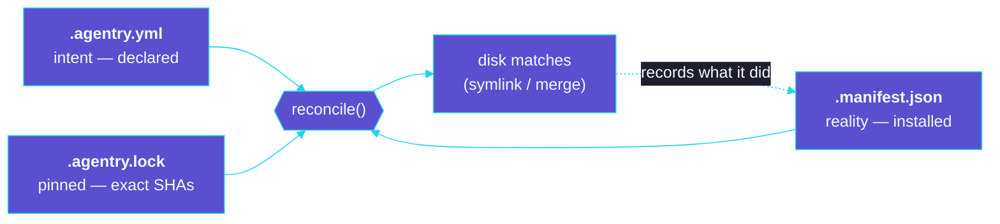
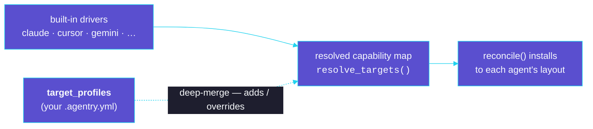

# agentry — Architecture

> The canonical design reference. If you're changing behavior, update this doc.

## 1. Problem: AI integration chaos

The AI ecosystem is expanding without standardization. A project that uses AI coding
tools accumulates **skills, agents, commands, tools, hooks, and MCP servers**, each of
which has to be dropped into a tool-specific location by hand:

- Claude Code reads `.claude/skills/`, `.claude/agents/`, `.claude/commands/`, `.claude/settings.json`, `.mcp.json`
- OpenCode reads `.opencode/…` and `opencode.json`
- Cursor reads `.cursor/rules/` and `.cursor/mcp.json`

…and the same again for every other agent. Seven agents ship as built-in drivers today
(Claude Code, OpenCode, Cursor, Codex, Gemini CLI, Windsurf, Kimi — see [§5](#5-drivers-the-target-side-drivers-specpy-targetspy)),
and you can add more from config alone.

Copy-pasting these by hand produces the classic failures software solved long ago:
no versioning, no single source of truth, duplicated effort across projects, drift
between machines, and no safe way to uninstall. This is **dependency hell** for AI.

## 2. Solution: dependency management for AI

`agentry` treats AI components as packages, modeled on `pip` / `yarn` / `uv`:

| File | Role | Committed? |
|---|---|---|
| `.agentry.yml` | **Intent** — declared sources + components (hand-editable) | ✅ yes |
| `.agentry.lock` | **Resolved truth** — exact commit SHAs / content hashes | ✅ yes |
| `.agentry/` | **Store** — downloaded git clones / local symlinks | ❌ gitignored |
| `.agentry/.manifest.json` | **Reality** — what is actually installed on disk | ❌ gitignored |

The three-way relationship is the heart of the design — `reconcile()` (run by `agy sync`)
makes the disk match the declared, pinned intent:



## 3. Component model

```
ComponentType: skill | agent | command | tool | hook | mcp
Strategy:      link (file-based) | merge (config-based) | generate (self-installing)
```

| Type | Strategy | Why |
|---|---|---|
| skill, agent, command, tool | **link** | They are files/dirs a tool reads from a directory |
| hook, mcp | **merge** | They are entries inside a tool's JSON config, not standalone files |
| any (opt-in) | **generate** | The component has no symlinkable artifact and installs itself by running its own CLI |

**Generate strategy.** A component may carry a `generate` spec (`setup`/`command`/`produces`)
instead of an artifact — for tools like graphify that ship no skill file and generate one at
install time. Running third-party commands is **opt-in** (`agy sync --allow-run`) and the
commands are printed before execution; `produces` lists the project-relative paths agentry
tracks so removal deletes exactly those and nothing else. See `installers/generate.py`.

## 4. Source-repo layout — convention or descriptor

A source (git repo or local dir) provides components in one of two ways. `discovery.py`
picks the descriptor when present, else falls back to the convention scan.

**Convention** — mirror the standard agent layout:

```
skills/<name>/        directory (e.g. contains SKILL.md)        → link
agents/<name>.md      file                                      → link
commands/<name>.md    file                                      → link
tools/<name>/         directory                                 → link
hooks/<name>.json     JSON object of named entries              → merge
mcp/<name>.json       JSON object of named entries              → merge
```

**Descriptor** — an optional `agentry.yaml` (or `.yml`) at the source root lets a repo
**self-describe** an arbitrary layout. Each `provides` entry is either an explicit
`{ name, path }` or a `{ glob }` (name derived from each match — file stem, or dir name):

```yaml
# <source-repo>/agentry.yaml
version: 1
provides:
  skill:   [ { name: code-reviewer, path: packages/code-reviewer } ]
  agent:   [ { glob: "ai/agents/*.md" } ]
  mcp:     [ { glob: "servers/*.json" } ]
```

The component *type* still dictates shape (dir vs file + extension); the descriptor only
says *where*. Absent ⇒ convention scan (full back-compat).

**Consumer-side overrides (third way).** When a source follows neither layout — a common
case for third-party skills whose repo *is* the skill — the consumer's `.agentry.yml`
component can resolve it directly, bypassing discovery:

- `path:` on a component points at an explicit artifact within the source (`path: "."` ⇒
  the source root is the skill). Handled in `reconcile.compute_desired`.
- `generate:` on a component installs via the generate strategy instead of an artifact.

**Catalogs (`registry.py`).** A `repositories:` list in `.agentry.yml` points at JSON
catalogs (a local file or an http(s) URL) that map a bare repo name to its source + optional
curated components. `agy add <repo>` consults them in order and synthesizes the same Sources +
Components a user would hand-write, installing all of them, a `@name`-selected subset, or a
`--type`-filtered subset — so catalogs add resolution only, no new install mechanics. The
catalog is the JSON contract a hosted "artifactory" server would serve, so file and server are
interchangeable. URL catalogs are cached under `.agentry/repositories/`.

A conventional-layout repo needs only a `source`; `expose` declares curated components (and
carries the `path`/`generate` for artifacts discovery can't infer). Two optional per-repo flags
shape the install layout at `agy add` time:

- `"copy": true` — install this repo's file/dir components by **copying** instead of symlinking
  (real files, committable; default `false`).
- `"namespaced": true` (the **default**) — nest installs under a `<repo>/` subfolder for the
  component types the target agent's driver namespaces. The claude driver namespaces
  **commands** and **agents**, so a plugin's slash commands become namespaced
  (`.claude/commands/<repo>/adr.md` → `/<repo>:adr`); skills stay flat (Claude Code only
  discovers `.claude/skills/<name>/SKILL.md`). Set `"namespaced": false` for a flat layout.

```json
{
  "version": 1,
  "repositories": {
    "arckit": {
      "summary": "Architecture governance toolkit (skills, agents, commands, …)",
      "source": { "type": "git", "url": "https://github.com/tractorjuice/arc-kit", "ref": "main", "subdir": "plugins/arckit-claude" }
    },
    "graphify": {
      "summary": "Codebase → knowledge graph",
      "source": { "type": "git", "url": "https://github.com/safishamsi/graphify", "ref": "main" },
      "expose": [
        {
          "type": "skill",
          "name": "graphify",
          "generate": {
            "setup":   [["uv", "tool", "install", "graphifyy"]],
            "command": ["graphify", "install", "--project"],
            "produces": [".claude/skills/graphify"]
          }
        }
      ]
    }
  }
}
```

**Authoring a catalog (`agy catalog add-repo`).** Add an entry from a git/GitHub URL — a browser
`…/tree/<ref>/<subdir>` URL infers the `ref` and `subdir`; the name defaults to the repo
basename. `--discover` clones the repo and pre-fills `expose` from the components it finds. The
default catalog file is `registry/repositories.json` (override with `--file`).

**Dependencies (`requires`).** A descriptor entry may declare components it needs. Each
`requires` item points at another component by `type` + `name`, living in one of three
places — and is version-pinnable via `ref`:

```yaml
provides:
  skill:
    - name: code-reviewer
      path: skills/code-reviewer
      requires:
        - { type: skill, name: shared-style }                       # same source (this repo)
        - { type: tool, name: ripgrep, source: utils }              # another configured source
        - { type: skill, name: linter, url: "https://github.com/acme/linters.git", ref: v2 }
```

A `url` dependency is pulled in **transitively**: agentry synthesizes a source for it,
records it in `.agentry.lock` (marked `synthesized: true`), and installs it — but never
writes it into `.agentry.yml`. Intent stays minimal; the lock captures the full closure.
Only descriptor sources can declare dependencies (the convention scan carries none).

**Merge fragment contract.** A `hooks/*.json` or `mcp/*.json` file is a JSON **object of
named entries**. Each top-level key is merged under the target's pointer, and agentry
records exactly those keys so removal never disturbs hand-added entries. Example
`mcp/github.json`:

```json
{ "github": { "command": "npx", "args": ["-y", "@modelcontextprotocol/server-github"] } }
```

A fragment may also arrive **wrapped** under the section name it targets — the shape
real-world plugin files ship. A Claude Code `hooks.json` is
`{ "description": ..., "hooks": { "Stop": [...] } }` and an `.mcp.json` is
`{ "mcpServers": { ... } }`. `merge.select_entries` unwraps such a fragment using the
destination's `wrapper_keys` (the `pointer` plus any `aliases` — e.g. OpenCode's `mcp`
config also accepts the Claude-style `mcpServers` wrapper), so the real named entries
are merged and sibling metadata like `description` is dropped. An already-flat fragment
is used unchanged, so both shapes work.

**Per-harness fragment routing.** A repo may ship tool-specific hook/MCP fragments side by
side — e.g. `hooks/hooks.json` (canonical), `hooks/hooks-cursor.json`, `hooks/hooks-codex.json`.
agentry reads the `-<harness>` suffix and routes each variant **only** to its matching target, so
a Cursor or Codex fragment never lands in Claude's `settings.json`. The canonical, suffix-less
file applies to every target that supports the type. As a final guard, a hook event Claude Code
doesn't recognize is dropped from `.claude/settings.json` with a warning rather than written out.

## 5. Drivers — the target side (`drivers/`, `spec.py`, `targets.py`)

agentry's model has **two sides**. The **source side** (§4) is *canonical*: a repo author
writes a component once, in one place. The **target side** is a set of **drivers** — one
per AI agent — that each say *how* and *where* those components install into that agent.
This split is what lets one component repo serve many agents: author once, map per driver.

A **driver** ([`drivers/<agent>.py`](https://github.com/OpenTechIL/agentry)) is a small
dataclass that *composes* two things:

1. A **capability map** (`spec.TargetSpec`): per component type, a **link**/**copy**
   destination (path template) or a **merge** destination (config file + JSON pointer). A
   type absent from the map is unsupported for that agent → skipped with a warning.
2. Optional **per-agent policies** for behavior that isn't pure path placement:
   - `HookEventPolicy` — validate hook-event keys (Claude Code rejects a `settings.json`
     carrying unknown event keys, so the claude driver drops them with a warning). No-op
     for agents without one.
   - `NamespacePolicy` — which component types nest under a `<repo>/` subfolder. The claude
     driver namespaces commands/agents (`.claude/commands/<repo>/adr.md` → `/<repo>:adr`).
   - `transform` — a **reserved seam** for future *semantic translation* (e.g. rewriting a
     fragment between JSON/TOML/YAML, or between agent formats). Default `None` everywhere
     today: agentry maps **placement**, it does not yet translate component formats.

`resolve_drivers(config)` is the effective map. It reuses `resolve_targets(config)` — the
single place that deep-merges the project's `target_profiles` over the built-in capability
maps — then re-attaches each built-in agent's policies. A tool defined **only** in
`target_profiles` (target ids are open strings, not a closed enum) gets a default
no-policy driver, so the data-driven escape hatch needs no code:

```yaml
# .agentry.yml
targets: [claude, mycli]              # active tools — may include custom names
target_profiles:
  mycli:                              # a new tool, no code required
    skill: { strategy: link,  dest: ".mycli/skills/{name}" }   # quote: {name} is literal
    mcp:   { strategy: merge, file: ".mycli/config.json", pointer: "mcpServers" }
  claude:
    tool:  { strategy: link,  dest: ".claude/plugins/tools/{name}" }   # override one path
```

> YAML note: a `dest` containing `{name}` must be **quoted**, or YAML reads `{…}` as a flow mapping.

An active target with neither a built-in driver nor a profile is reported via `unresolved_targets`.

Adding an agent is **data, not a code change** — `target_profiles` deep-merges over the
built-ins to override paths or introduce an entirely new tool:



### Built-in drivers

| Type | Claude Code | OpenCode | Cursor | Gemini CLI | Windsurf | Kimi | Codex | Copilot | Kiro | Agents (universal) |
|---|---|---|---|---|---|---|---|---|---|---|
| skill | `.claude/skills/{name}` | `.opencode/skills/{name}` | — | `.gemini/skills/{name}` | `.windsurf/skills/{name}` | `.kimi-code/skills/{name}` | `.agents/skills/{name}` | `.github/skills/{name}` | `.kiro/skills/{name}` | `.agents/skills/{name}` |
| agent | `.claude/agents/{name}.md` | `.opencode/agents/{name}.md` | `.cursor/rules/{name}.mdc` | `.gemini/agents/{name}.md` | — | — | — | `.github/agents/{name}.agent.md` | — | — |
| command | `.claude/commands/{name}.md` | `.opencode/commands/{name}.md` | `.cursor/rules/{name}.mdc` | `.gemini/commands/{name}.toml` | `.windsurf/workflows/{name}.md` | — | — | `.github/prompts/{name}.prompt.md` | — | — |
| tool | `.claude/tools/{name}` | `.opencode/tools/{name}` | — | — | — | — | — | — | — | — |
| hook | merge `.claude/settings.json` → `hooks` | — | — | merge `.gemini/settings.json` → `hooks` | merge `.windsurf/hooks.json` → `hooks` | — | — | — | — | — |
| mcp | merge `.mcp.json` → `mcpServers` | merge `opencode.json` → `mcp` | merge `.cursor/mcp.json` → `mcpServers` | merge `.gemini/settings.json` → `mcpServers` | — | merge `.kimi-code/mcp.json` → `mcpServers` | merge `.codex/config.toml` → `mcp_servers` | merge `.vscode/mcp.json` → `servers` | merge `.kiro/settings/mcp.json` → `mcpServers` | — |

A `—` means the agent either has no such concept or expects a format agentry can't yet
write. The newest drivers map what installs cleanly: skills everywhere, and MCP/hooks
merged wherever the destination is JSON **or TOML**. The merge installer chooses the codec
by the destination's extension — Codex's MCP servers merge into `.codex/config.toml` under
the snake_case `[mcp_servers]` table (written with `tomlkit`, preserving the rest of the
file), while the source fragment stays JSON. Still unmapped: per-tool **agent/command
definition formats** agentry doesn't translate (e.g. Gemini's TOML commands install via
`link` only when authored in that format), and **array-of-tables hooks** (Codex
`[[hooks.Event]]`, Kimi `[[hooks]]`) which don't fit the named-entry merge contract.

## 6. The reconcile flow (`agy sync`)

```
1. Resolve sources + dependency closure   deps.resolve_graph(config, lock, update=…)
   ├─ resolve every config source         resolver.resolve(source, pinned=lock_sha or None)
   │    ├─ git:   clone once → fetch → checkout --detach <sha>  → resolved = SHA
   │    └─ local: symlink store/<name> → abspath(path)          → resolved = sha256(tree)
   ├─ walk requires from the enabled roots (BFS), recursing into each dep's own descriptor
   │    ├─ url dep → synthesize a lock-only source, download, recurse
   │    ├─ cycles broken by a visited set on the component ref
   │    └─ version conflict (same repo/source, two refs) → abort with a clear error
   └─ emit an augmented (sources + components) graph; write .agentry.lock.

2. Compute desired state          reconcile.compute_desired(augmented_config)
   for each ENABLED component × each applicable target:
     LINK     → DesiredLink(dest path, store artifact)   [path: override skips discovery]
     MERGE    → DesiredMerge(config file, pointer, fragment keys)
     GENERATE → DesiredGenerate(component, generate spec)

3. Diff against the manifest and apply
   links:     remove manifest links not desired (safe-remove) → create/refresh desired
   merges:    remove manifest merges not desired (strip keys) → inject desired keys
   generated: remove orphans (delete produced paths) → run (only with --allow-run), record produced paths

4. Persist manifest; ensure .agentry/ is in .gitignore.
```

`sync` is **idempotent**: a second run with the same inputs is a no-op. With
`update=True` it ignores the locked SHA, re-resolves each ref to its tip, and rewrites
the lock — the only operation that advances versions.

## 7. Safety model

agentry never destroys anything it didn't create. Two invariants enforce this:

- **Links** — `link.remove_link` / overwrite only act on a path that is a symlink whose
  *lexical* target resolves into `.agentry/`. A user-authored file or an unrelated
  symlink at the same path is left alone (and overwrite raises rather than clobbers).
  The check is lexical (`abspath`, not `resolve`) so a local source — itself a symlink
  in the store — is still recognized as managed.
- **Merges** — `merge.remove_merge` only deletes the specific keys recorded in the
  manifest. Hand-added entries under the same pointer survive.

## 8. Module map

```
cli.py          Typer app — command wiring + Rich output
models.py       pydantic: Config, Source, Component, Lock, Manifest, enums
config.py       .agentry.yml round-trip (ruamel, comment-preserving) + mutators
lockfile.py     .agentry.lock read/write
spec.py         capability-map dataclasses (TargetSpec / MergeDest / LinkMergeDest)
drivers/        one module per AI agent (claude, opencode, cursor, codex, gemini, windsurf, kimi, copilot, kiro)
                 plus `agents` — the tool-neutral .agents/skills universal target
  base.py       Driver = capability map + optional policies (hook-event, namespace, transform)
  __init__.py   BUILTIN_DRIVERS registry + resolve_drivers()
targets.py      effective capability map: BUILTIN_TARGETS (from drivers) + target_profiles merge
discovery.py    scan a source for available components + their `requires` (LAYOUT)
resolver.py     download/checkout into the store; resolve refs → SHA/hash
deps.py         transitive dependency closure (recursive, version-aware) → augmented graph
registry.py     resolve a bare repo name via external catalogs (file/URL) → Sources + Components
manifest.py     .agentry/.manifest.json read/write
installers/
  link.py       symlink create/remove/state (lexical, store-scoped)
  merge.py      JSON/TOML inject/remove/state (key-scoped, reversible; codec by file ext)
  generate.py   run a component's own installer (gated); track produced files for safe removal
reconcile.py    sync engine + status (drift report)
gitignore.py    ensure .agentry/ is ignored
```

## 9. Extension points

- **New agent (driver)** — *no code needed* for a one-off: define the tool under
  `target_profiles` in `.agentry.yml`. To ship it as a **built-in driver**, add a
  `drivers/<agent>.py` exposing a `DRIVER` (its `TargetSpec` + any policies), register it in
  `BUILTIN_DRIVERS`, add the name to `models.BUILTIN_TARGET_NAMES`, and add a `test_drivers.py`
  case. See **Adding a driver** in `CONTRIBUTING.md`.
- **New component type** — add to `ComponentType`, `LINK_TYPES`/`MERGE_TYPES`, `TYPE_IS_DIR`/
  `TYPE_EXT`, and a destination in each relevant driver's `TargetSpec`.
- **New source layout** — *no code needed*: ship an `agentry.yaml` descriptor in the source repo.
- **New source kind** — add a `SourceType` and a branch in `resolver.resolve`.

## 10. Deferred (future phases)

- **Hosted catalog server** — the catalog format and name-based `agy add`/`agy search`
  ship today against file/URL catalogs (`registry.py`); a hosted catalog server + upload flow
  (serving the same JSON contract that `agy catalog add-repo` authors locally) is the remaining
  piece.
- **TOML array-of-tables hooks** — Codex (`[[hooks.Event]]`) and Kimi (`[[hooks]]`) keep hooks
  as an array of tables rather than named keys under a pointer, so they don't fit the current
  key-scoped reversible merge contract. (TOML *named-table* merge — Codex MCP `[mcp_servers]` —
  already ships; see §5.)
- **Semantic translation** — the `transform` seam on a driver (§5) would let a component
  authored for one agent be reshaped for another (format/field translation), turning today's
  placement-mapping into true write-once-run-anywhere.
- **Compatibility metadata** — components declare supported model/tool versions; sync warns on mismatch.
- **Hook array-merge** — richer merging for event-keyed hook arrays beyond the named-key contract.
- **Copy fallback** — copy instead of symlink for filesystems without symlink support (Windows).
- **TUI** — a Textual front-end over this same core (browse/toggle/sync).
