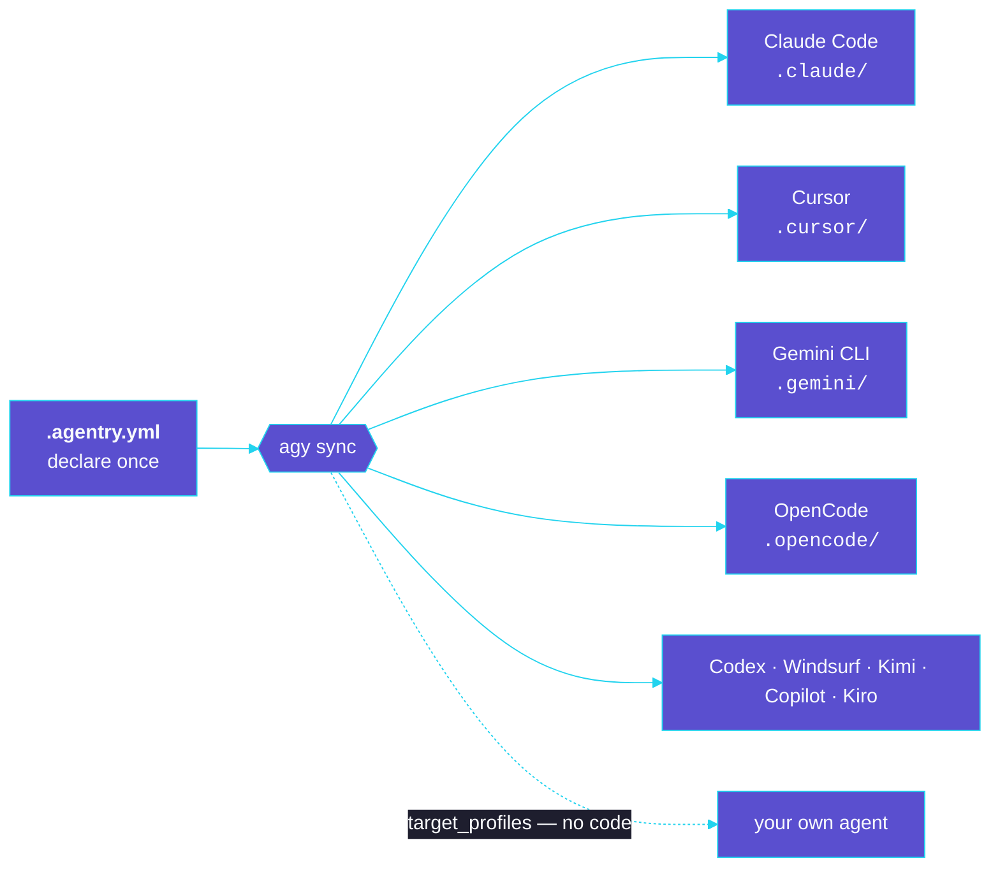

# agentry

**A dependency manager for AI coding agents.** `agentry` (command: `agy`) lets you
declare the skills, agents, commands, tools, hooks, and MCP servers your project uses —
then install them into Claude Code, Cursor, Gemini CLI, OpenCode, Codex, Windsurf, Kimi,
GitHub Copilot, and Kiro with one command. **Write once, deploy to any agent** — and teach
it new agents without writing code.

## The idea

Declare your components once; `agy sync` installs them into every agent you target — each in
its own native layout:



Treat AI components like packages:

- **`.agentry.yml`** — a single, version-controlled file declaring your sources and components.
- **`.agentry.lock`** — exact resolved commit SHAs for deterministic, reproducible installs.
- **`.agentry/`** — a local store (git clones / local copies), git-ignored like `node_modules`.
- One `agy sync` installs everything into each tool's native layout — via **symlinks**
  (skills/agents/commands/tools) or **reversible config merges** (hooks/MCP).

What that gets you:

- **Write once, install everywhere** — one declaration installs into every enabled agent.
- **Project-scoped, not global** — isolated, reproducible, committable environments.
- **Split skills across projects** — share sources across initiatives without conflicts.
- **Extensible by data, not code** — define a brand-new agent in `.agentry.yml` via
  `target_profiles`; no fork, no plugin.

## Get started

Run straight from git with [`uv`](https://docs.astral.sh/uv/) — no global install needed:

```bash
uvx --from git+https://github.com/OpenTechIL/agentry agy --help
```

See the [README](https://github.com/OpenTechIL/agentry#readme) for the full quickstart and
command reference.

## Learn more

- **[Architecture](architecture.md)** — the design, data model, reconcile flow, and safety
  invariants (the source of truth for behavior).
- **[Knowledge base](knowledge-base.md)** — patterns, pitfalls, and discoveries.
- **[Branding](branding-kit.md)** — logo and brand guidelines.
- **[Contributing](https://github.com/OpenTechIL/agentry/blob/main/CONTRIBUTING.md)** — dev
  setup, conventions, and how to add targets/component types.
