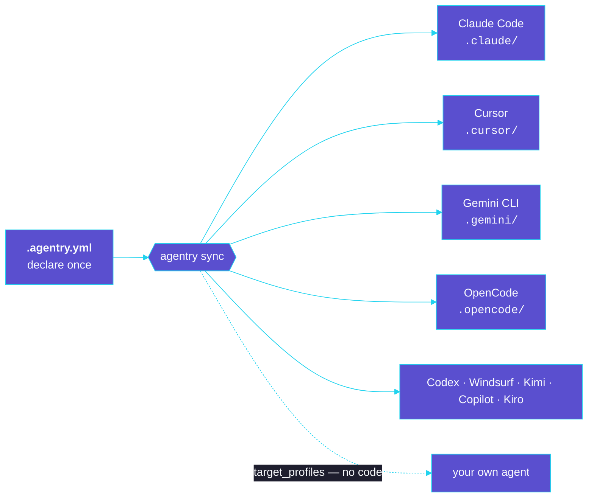

# agentry

**A package manager for the files your AI coding agents read.**

If you use Claude Code, Cursor, Copilot, Gemini CLI or any of their cousins, you have
`.claude/`, `.cursor/` and `.gemini/` folders filling up with skills, subagent definitions,
slash commands, hooks and MCP server configs — managed by copying files around. agentry
does for those files what `npm` did for JavaScript libraries: **declare what you want in
one file, and one command installs it into every tool you use.**

> agentry is a *dependency manager*, not an agent or a runtime. It installs the components
> your agents read, then gets out of the way — nothing of it runs while your agents do.


```mermaid
%%{init: {'theme':'base','themeVariables':{'primaryColor':'#5A4FCF','primaryTextColor':'#F8FAFC','lineColor':'#22D3EE','primaryBorderColor':'#22D3EE','secondaryColor':'#1E1E2E'}}}%%
flowchart LR
  Y["<b>.agentry.yml</b><br/>declare once"] --> S{{"agentry sync"}}
  S --> C["Claude Code<br/><code>.claude/</code>"]
  S --> U["Cursor<br/><code>.cursor/</code>"]
  S --> G["Gemini CLI<br/><code>.gemini/</code>"]
  S --> O["OpenCode<br/><code>.opencode/</code>"]
  S --> X["Codex · Windsurf · Kimi · Copilot · Kiro"]
  S -.->|"target_profiles — no code"| N["your own agent"]
```

Four moving parts: **`.agentry.yml`** (your declared intent, committed), **`.agentry.lock`**
(resolved commit SHAs, committed, for reproducible installs), **`.agentry/`** (a local store
of clones, git-ignored like `node_modules`), and **`agentry sync`**, which reconciles the
two — installing via symlinks (skills/agents/commands/tools) or reversible, key-scoped
config merges (hooks/MCP).

## Install

```bash
# macOS / Linux
curl -fsSL https://raw.githubusercontent.com/OpenTechIL/agentry/main/install.sh | sh
# Windows (PowerShell)
irm https://raw.githubusercontent.com/OpenTechIL/agentry/main/install.ps1 | iex
```

This installs `agentry` plus the short aliases `agyx` and `agy`. Note `agy` is also Google's
Antigravity CLI command — if you have both, prefer `agentry` or `agyx`
(see [Troubleshooting](troubleshooting.md#the-agy-command-runs-the-wrong-tool)).

Package managers, native installers (`.pkg`, `.exe`, `.deb`, `.rpm`) and the Python routes
are all covered in the [README](https://github.com/OpenTechIL/agentry#install).

## Your first five minutes

```bash
agentry init --target claude      # .agentry.yml + .gitignore + the default catalog
agentry search                    # see what the catalogs offer
agentry add markitdown-for-ai     # install one by name — downloads and installs
agentry status                    # what's installed, where, and whether it drifted
agentry doctor                    # health check, if anything looks off
```

Then commit `.agentry.yml` and `.agentry.lock`, and a teammate reproduces your exact setup
with `agentry sync --frozen`.

The [narrated quickstart in the README](https://github.com/OpenTechIL/agentry#quickstart)
walks through the same steps with the real output of each one and an explanation of what it
did.

## Learn more

- **[Commands](commands.md)** — the full command reference.
- **[Configuration](config-reference.md)** — every `.agentry.yml` key, with an annotated example.
- **[Authoring](authoring.md)** — write a component repo, a descriptor, or a catalog entry.
- **[Troubleshooting](troubleshooting.md)** — the failures people actually hit, and the fix.
- **[Architecture](architecture.md)** — the design, data model, reconcile flow, and safety
  invariants (the source of truth for behavior).
- **[Knowledge base](knowledge-base.md)** — the maintainers' engineering journal: decisions and
  pitfalls recorded as they happened.
- **[Branding](branding-kit.md)** — logo and brand guidelines.
- **[Contributing](https://github.com/OpenTechIL/agentry/blob/main/CONTRIBUTING.md)** — dev
  setup, conventions, and how to add targets/component types.
